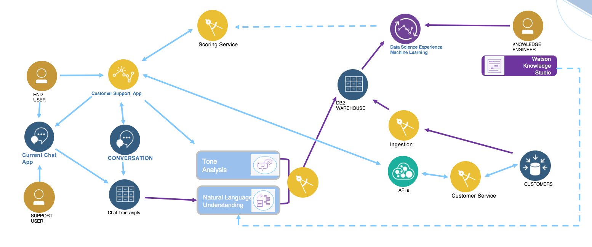
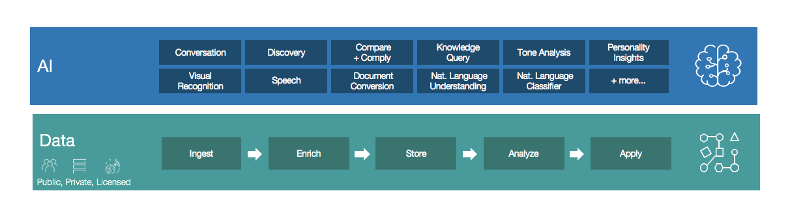
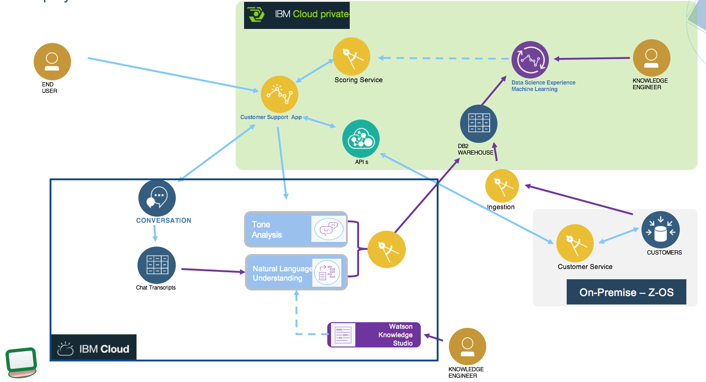

# Customer analysis with cognitive and analytics
The goal of this implementation is to deliver a reference implementation for data management and service integration to consume structured and unstructured data to assess customer attrition.
Modern applications are leveraging a set of capabilities to do a better assessment of customer characteristics and deliver best actions or recommendations. The technologies involved, include artificial intelligence, data governance, ingestion, enrichment, storage, analysis, machine learning, unstructured data classifications, natural language understanding, image recognition, speech to text, ....
## Target audience
* Architects who want to understand the components involved and the architecture constraints and design considerations
* Developer who want to get starting code, and educate on the related technologies
* Data Scientists who want to complement machine learning with cognitive output like classification
## Key points
* Data scientists need different source of data, structured from traditional SQL based database (e.g. the customers and accounts data) and new cognitive output, processing unstructured data.

## Table of contents
* [Presentation](#presentation)
* [Repositories](#repositories)
* [Run](./docs/run.md)
* [Methodology](#methodology)
* [Deployment](#deployment)
* [Implementation detail](./docs/code.md)
* [Compendium](#compendium)

## Presentation
### Use case
Eddie is an existing Green Telco Inc customer living in Orlando Fl.  He has been using the services provided by the Green Telco for the last 2 years. Currently, he is not under any contract.  Eddie signed for a new phone which was "buy one get one" free bundle. He bought one of the phone with cash and he put the other phone on a monthly plan. For Eddie to get the second phone free he has to submit the receipt to the Green Telco to get an equivalent value of the phone as a credit card. Eddie was traveling to conferences in Madrid and in Bangkok so he also signed up for international text and data service.  

So he owns two phones:  
* Sam Milky Way Phone 1   $750   paid in full with cash
* Sam Milky Way Phone 2   $750   on a monthly plan of $30

Upon submission of receipt the Green Telco company sends a Credit Card of $750. Eddie can use the Credit card to pay the balance of $750 for phone 2. Further, Eddie signed for free international text and data for a fee of $10 a month when he is traveling overseas to Madrid and, Bangkok.

After Eddie submitted the receipt to the Green Telco provider, Eddie went to Madrid and then to Bangkok.

While in Bangkok the data plan and the text plan was very slow and did not perform to the level that the sales person at the Green Telco had suggested Eddie that it will work.  By paying $10 per month extra Eddie was told that he will get double the speed. In reality the original speed was very less and even after double the speed, the speed was very less. So, Eddie was not very happy with the service. Eddie, felt that the sales person did not reveal all the information.

To add insult to injury when Eddie came back to check on his status for the free phone (he had not received any notification from the Green Telco). So, Eddie contacts the Telecom provider support via a chat bot on the web application.

The telecom provider informs Eddie that his claim was rejected and that he does not qualify for the $750 phone.

Eddie, who was already not happy with the International Data and Text service he had signed-up for and now he was not getting his refund.

The chat bot then checks the customer churn scoring service and finds out that the customer churn predicts a churn with a very high level of confidence and immediately notifies Eddie that a supervisor will contact Eddie to resolve the issue.

The supervisor contacts Eddie immediately. He apologizes to Eddie that the speed to begin with is very low and even by adding $10 the double speed does not make much of a difference. This service is mostly designed for texting and browsing emails and some important work and not designed for the kind of quality of service that Eddie is used to in the US.

Further the supervisor explains to Eddie that the reason he was not given the $750 is because both the phones have to be on contract payment. Since one of the phone was a cash payment the promotion does not apply. The supervisor acknowledged that to fix the problem, she had called the store and if Eddie goes to the store the previous transaction will be reversed and both the phone would be put on contract and his $750 payment will be expedited.

Eddie walks in the store and his problem was resolved. Once, he got the refund in one week he paid the first phone with his cash and the second phone with the $750 visa card.

The customer churn service helped Eddie to remain as the customer for the Green Telco.

### System Context diagram
The following diagram illustrates the system context of the application, including analytics model preparation and run time execution.

From left to right the components involved are:
* Web application to offer a set of services for the end user to use: from this user interface the end user, customer of Green Telco, can access his account, pay his bill and use the chat bot user interface to get support. The chat bot is implemented with Watson Conversation. [This note](docs/code.md) presents in details the implementation.
* The current chat application is not using any automated bot, but is a messaging application with human as actors. The conversation transcripts are presisted in a document oriented database.
* A scoring service to assess current risk of churn for that customer interacting with services of the company. This is a runtime analytics service.
* The conversation sentence can be analyzed for tone classification, those data are used by the scoring service
* The customer data are persisted in on-premise server with relational database, and micro service as front end.
* API product can be defined on top of the customer management service to monitor API usage and perform API governance
* Data scientists use machine learning library and notebook in Data Science Experience to discover the model.
* The data used by data scientists are persisted in Db2 warehouse.
* Ingestion mechanism can move historical data, for chat transscripts and customer records to the DB2 warehouse.

## Repositories
This repository presents best practices to deploy such solution on public and private cloud, implements the webapp deployable in public or private cloud, and deliver example of data sets.

The input data will be :
- customer demographics and other meta data as structured data, persisted in DB2
- call center recording
- chat bot transcripts
- emails content and classification.

* [Customer management micro-services](https://github.com/ibm-cloud-architecture/refarch-integration-services) Supports the implementation of the customer management micro service and DB2 schema.

## Methodology
The following diagram illustrates the artificial intelligence / cognitive capabilities developers can integrate in their business application. data scientists can leverage to develop their analytics models, and the data tasks that need to be perform on private, public or licensed dataset.

## Deployment
There are multiple possible configuration for the deployment depending of the use of public and private cloud.

# Compendium

# Contribute
We welcome your contribution. There are multiple ways to contribute: report bugs and improvement suggestion, improve documentation and contribute code.
We really value contributions and to maximize the impact of code contributions we request that any contributions follow these guidelines
* Please ensure you follow the coding standard and code formatting used throughout the existing code base
* All new features must be accompanied by associated tests
* Make sure all tests pass locally before submitting a pull request
* New pull requests should be created against the integration branch of the repository. This ensures new code is included in full stack integration tests before being merged into the master branch.
* One feature / bug fix / documentation update per pull request
* Include tests with every feature enhancement, improve tests with every bug fix
* One commit per pull request (squash your commits)
* Always pull the latest changes from upstream and rebase before creating pull request.

If you want to contribute, start by using git fork on this repository and then clone your own repository to your local workstation for development purpose. Add the up-stream repository to keep synchronized with the master.
This project is still under active development, so you might run into [issues](https://github.com/ibm-cloud-architecture/refarch-cognitive-analytics/issues)
Please [contact me](boyerje@us.ibm.com) for any questions.
