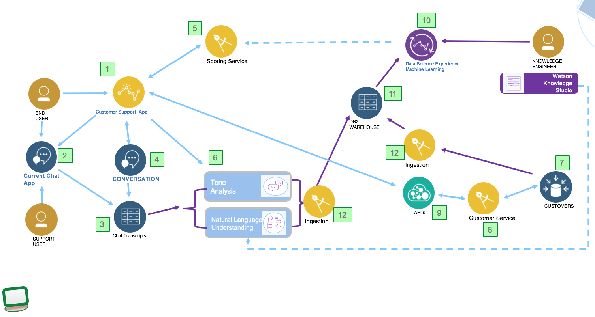

# Customer analysis with cognitive and analytics
The goal of this implementation is to deliver a reference implementation for data management and service integration to consume structured and unstructured data to assess customer attrition.
Modern applications are leveraging a set of capabilities to do a better assessment of customer characteristics and deliver best actions or recommendations. The technologies involved, include artificial intelligence, data governance, ingestion, enrichment, storage, analysis, machine learning, unstructured data classifications, natural language understanding, image recognition, speech to text, ....

This repository addresses some of those technologies and presents best practices to deploy such solution on public and private cloud.

The input data will be :
- customer demographics and other meta data as structured data, persisted in DB2
- call center recording
- chat bot transcripts
- emails content and classification.

The following diagram illustrates the system context of the application, including analytics model preparation and run time execution.

The components involved are:
* Web application to offer a set of services for the end user to use: the chat bot user interface will be used for the demonstration.
* A scoring service to assess current risk of churn for that customer interacting with services of the company

### Deployment View

