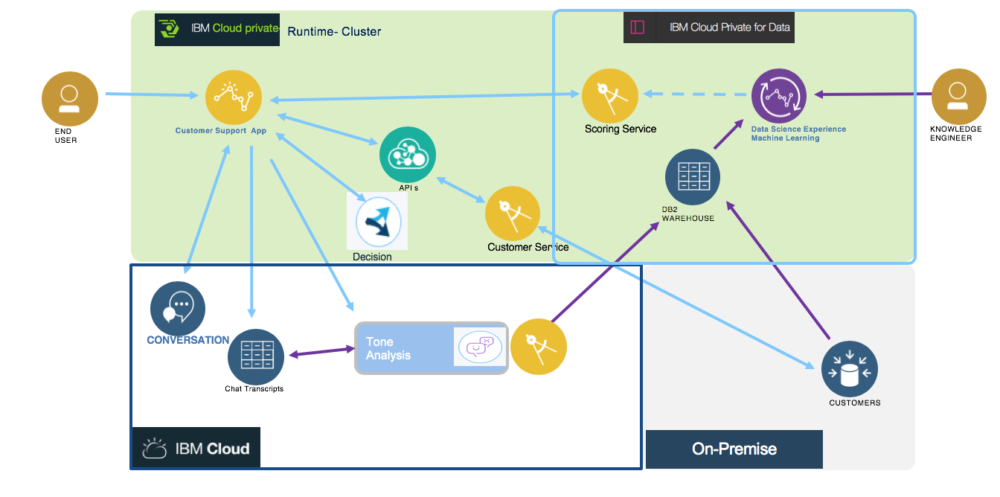

# Customer analysis with cognitive and analytics in hybrid cloud

This project is part of the 'IBM Hybrid Analytics and Big Data Architecture' reference architecture implementation, available at https://github.com/ibm-cloud-architecture/refarch-analytics.

The goal of this implementation is to deliver a reference implementation for data management and service integration to consume structured and unstructured data to assess customer attrition.

For better reading experience go to [the book view.](http://ibm-cloud-architecture.github.io/refarch-cognitive-analytics)

## Reuse this solution

We recommend git forking this project, clone it with `git clone https://github.com/ibm-cloud-architecture/refarch-cognitive-analytics` and then runs the following command to clone all the related repositories involved in this solution:

```shell
./scripts/clone.sh
```

Once done you can read the content of this repository as [a book](http://ibm-cloud-architecture.github.io/refarch-cognitive-analytics), or try our step by step [labs](docs/labs.md).

The main goal of this solution is to run in hybrid cloud, reusinf services from public cloud, private cloud and on-premise database servers. 



* The DB2 instance runs on separate on-premise servers, to illustrate the use case of keeping existing infrastructure investments.
* `customer manager` microservice runs on IBM Cloud Private, accessing customer and account tables deployed on DB2 servers outside of ICP.
* Watson Cognitive services are on IBM Cloud, public offering,
* The datasource to persist the conversation data is Cloudant DB on Public Cloud.

For the back end we have two options: Z OS with DB2 and Z Connect, and Java based REST micro service and DB2.

For the machine learning, three options:
 1. ICP for Data with Spark cluster for model execution
 1. Watson Data Platform on IBM Cloud with Watson ML on IBM Cloud for the scoring service
 1. Watson Studio deployed on ICP cluster.

### Using Watson Data Platform

As an alternate to use DSX on ICP to develop the machine learning model, Data Scientist can use Watson Data platform to gather the data from multiple datasources like Amazon S3, CloudantDB, and from transactional data, persist in public object store and deploy the model once trained to Watson Machine learning.


See [this note](docs/ml/README.md) for detail about the implementation of the analytic model, and the see the `WMLChurnServiceClient.js` code for the integration part.

### Building this booklet locally

The content of this repository is written with markdown files, packaged with [MkDocs](https://www.mkdocs.org/) and can be built into a book-readable format by MkDocs build processes.

1. Install MkDocs locally following the [official documentation instructions](https://www.mkdocs.org/#installation).
2. `git clone https://github.com/ibm-cloud-architecture/refarch-cognitive-analytics.git` _(or your forked repository if you plan to edit)_
3. `cd refarch-cognitive-analytics`
4. `mkdocs serve`
5. Go to `http://127.0.0.1:8000/` in your browser.

### Pushing the book to GitHub Pages

1. Ensure that all your local changes to the `master` branch have been committed and pushed to the remote repository.
   1. `git push origin master`
2. Ensure that you have the latest commits to the `gh-pages` branch, so you can get others' updates.
	```bash
	git checkout gh-pages
	git pull origin gh-pages
	
	git checkout master
	```
3. Run `mkdocs gh-deploy` from the root refarch-cognitive-analytics directory.

--- 

## Contribute

As this implementation solution is part of the Event Driven architeture reference architecture, the [contribution policies](./CONTRIBUTING.md) apply the same way here.

**Contributors:**

* [Amaresh Rajasekharan](https://www.linkedin.com/in/amaresh-rajasekharan/)
* [Sandra Tucker](https://www.linkedin.com/in/sandraltucker/)
* [Sunil Dube](https://www.linkedin.com/in/sunil-dube-b861861/)
* [Zach Silverstein](https://www.linkedin.com/in/zsilverstein/)
* [Jerome Boyer](https://www.linkedin.com/in/jeromeboyer/) 
* [Sourav Mazumder](https://www.linkedin.com/in/souravmazumder/)

Please [contact me](mailto:boyerje@us.ibm.com) for any questions.
