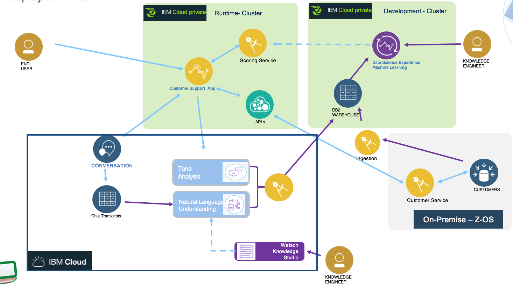
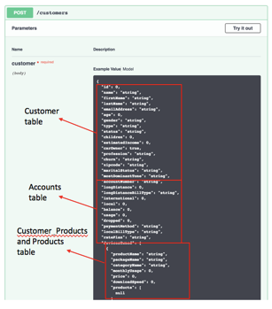
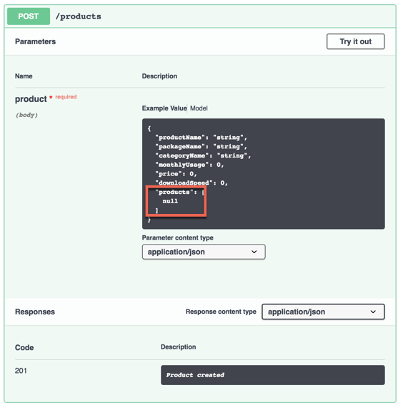

# Z OS Deployment
In this section we are detailing part of the backend service implementation using z Connect and DB2 on Z. The JAXRS micro service that manages the operation on the customer data source is mapped to a zConnect implementation. The DB2 schema is kept to have the 3 or 4 tables of the CUSTDB instance.

The API used for the implementation in the zOS Connect service can be found [here](https://github.com/ibm-cloud-architecture/refarch-integration-services/blob/master/src/main/webapp/META-INF/stub/swagger.yaml)

You can see that there are 4 different Db2 tables associated to this API and a single INSERT will not work.  To make this work, you will need to create a Native SQL procedure that you can invoke using a single CALL SQL statement which satisfies the requirement of a single SQL statement by z/OS Connect but internally is doing 4 INSERT SQL statements.

The API to do POST and GET for the products could be quick since it seems to map directly to the PRODUCTS table but I need to understand what is expected on the products list below (red box).

