# Defining customer API product
We are detailing how the `customer API` product was developed to integrate with the REST api back end. This is not a tutorial, this is more for education purpose.

## Pre-requisite
You need to have access to IBM API Connect management product. We have one instance within our on-premise server, soon we will use one on ICP. You need to access the swagger file from the [service project](https://github.com/ibm-cloud-architecture/refarch-integration-services/blob/master/src/main/webapp/META-INF/stub/swagger.yaml).

## Development steps done
### Step 1: Create product from swagger
Connect to the API manager, our url is 172.16.40.88/apim. From the main page click `Add` and select `Import API from file`

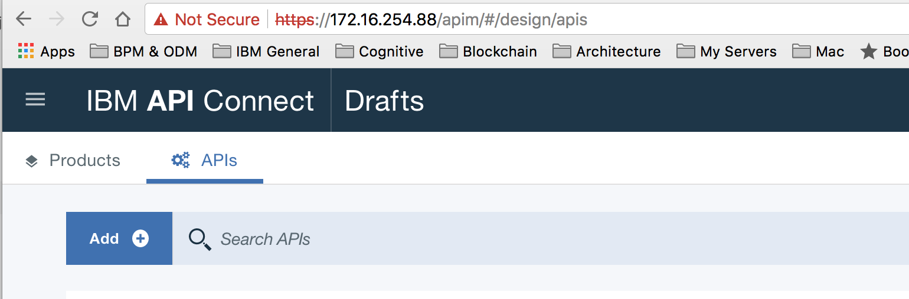.

Select the swagger `src/main/webapp/META-INF/stub/swagger.yaml` from the integation-service project:

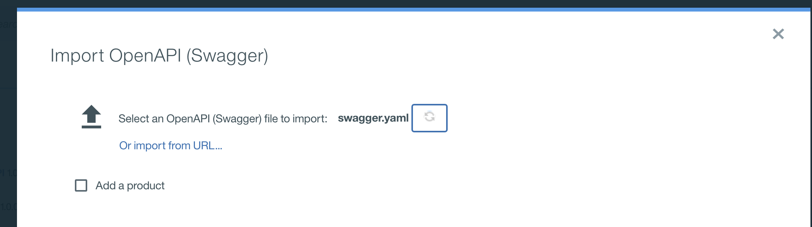

this should create a project customer-management-micro-service-api. The Paths section of the definition includes the CRUD operation on the customers resource:

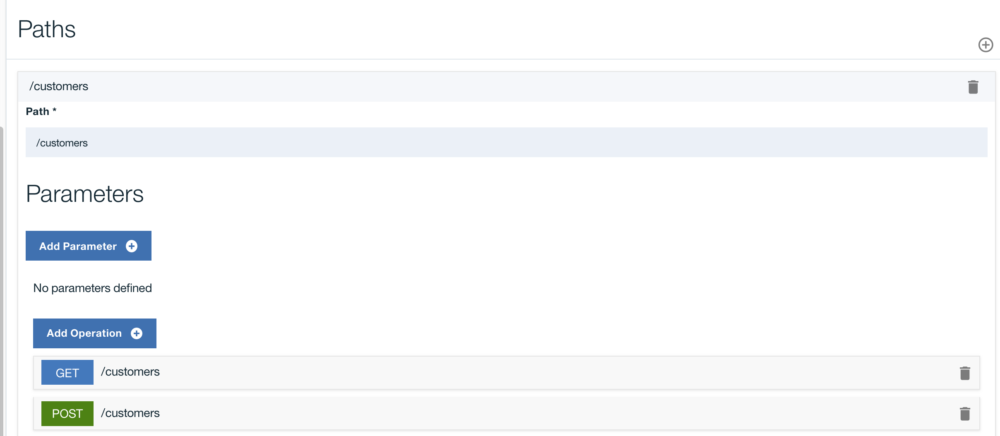

You do not need to use all the operations of the imported swagger, and it is possible to delete operations that we do not want to expose to external client applications.

Instead of using an already defined swagger you can develop the API definition manually in the API Designer tool and the following product documentation gives you some how to do it. https://www.ibm.com/support/knowledgecenter/en/SSMNED_5.0.0/com.ibm.apic.toolkit.doc/task_APIonPrem_createapi.html

Finally you can create a default product directly from the APIs:

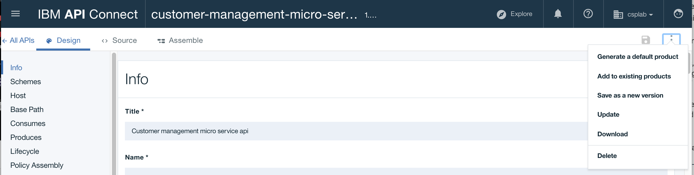

Products are just packaging for APIs and Plans.

## Step 2: Define operation mapping
You have two options here:
* taking the generic approach where all the defined APIs from the swagger are used as is in the new Product and the API gateway is just a proxy
* do some specific mappings, select a sub set of APIs and may be do some interface change.

API management is using its own vocabulary for such implementation:
* *Policies* are the building blocks of assembly flows, and they provide the means to configure capability, such as security, logging, routing of requests to target services, and transformation of data from one format to another.
*  Logic constructs behave in a similar way to policies, but they affect how and which parts of the assembly are implemented without modifying the data flow of the assembly.


1. Proxy policy
  To implement a generic proxy approach, open the `Assembly` editor and create a new assembly:

  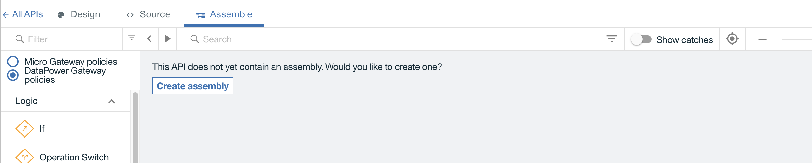

  between the two circles drag and drop a Proxy policy:

  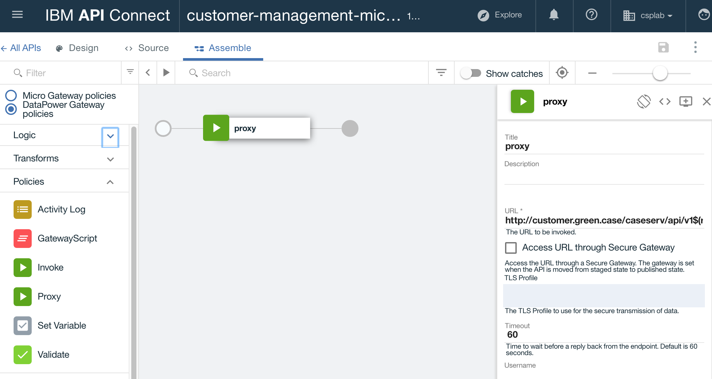

  Then in the URL specify the end point of the virtual host name of the deployed micro service within ICP. The hostname was specified within the deployment configuration of the service when deploying it to ICP within the Ingress construct.
  ```yaml
  ingress:
    enabled: true
    # Used to create Ingress record (should used with service.type: ClusterIP).
    hosts:
      - customer.green.case
  ```
  The URL includes the webcontext and URL mapping as defined in the `web.xml` file of the java webapp.
`http://customer.green.case/caseserv/api/v1$(request.path)`

  The variable request.path is the one defined in the Paths, for example can be `/customers/***REMOVED***id***REMOVED***`

  **Attention!:** there is something wrong here!. How API gateway that will run this product implementation will know how to map the customer.green.case host to the ICP proxy server responsible to route the traffic to the pod running the backend service? As this name is only known by ICP internal kubernetes DNS service.

  The solution is to define static host alias inside the API Gateway, or use a DNS server inside the same network. Our API datapower gateway is on the same IP network as our ICP cluster: 172.16.*.*.

  To add a host alias, connect to the API Gateway console using the port 9090. (https://172.16...:9090/console) as an admin user and using the Default domain so you can access the global settings. Then select network > interface > host alias to define a new entry.

  

 Once the configuration is saved you can use the ping remote host feature:
  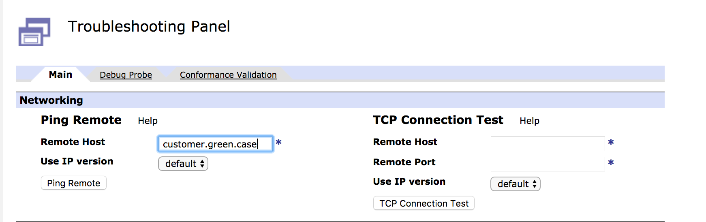

  Before going to the [unit test](#step-3:-unit-test) let see the other approach:

1. Map some operations

For each operation, define the mapping to the back end operation. So go to the `Assembly editor`, and drag and drop the `Operation switch` logic operator:

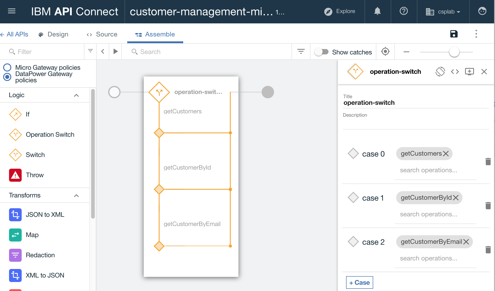

Add one case per operation you want to do a mapping to. We start by the three read only operations we need for the user interface to call: get all customer, get a customer given its id, and giving its email.

The following diagram illustrates an `Invoke` policy to call the back end:

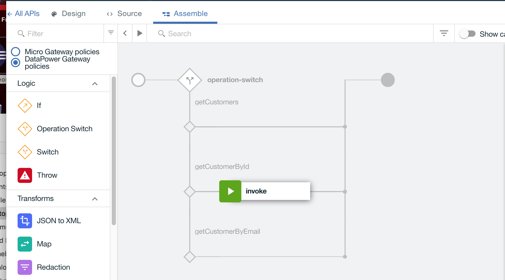

Specify the URL as before. There is way to add scripts, mapping ... before and after the invoke if needed.

## Step 3: unit test

To unit test, you need first to `republish` the product

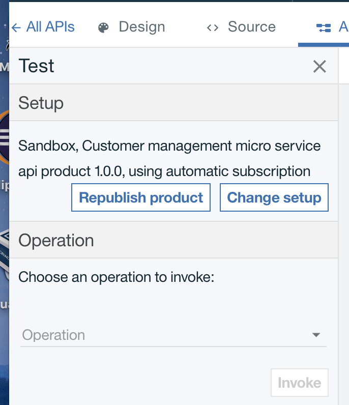

Then select the operation to trigger, like /customers/***REMOVED***id***REMOVED***, set the parameter, id=3 and `invoke` the service

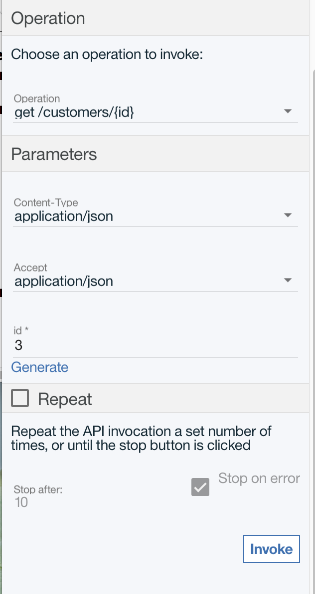

You should get the data coming from the customer database.

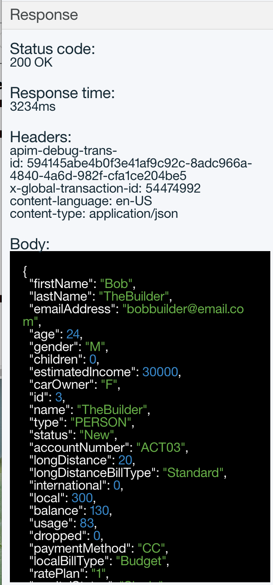

## Step 4: define and deploy product
Some important concepts to keep in mind: products provide a method by which you can group APIs into a package that is intended for a particular use or channel. Products contain Plans, which can be used to differentiate between different offerings.

To make an API available to an application developer, it **must be** included in a Plan. Products are then published in a Catalog.

A lifecycle manager can then control the availability and visibility of APIs and Plans through the API Manager. The application developer can only subscribe to one Plan from a specific Product.

In the product view, select the upload button on the right side to stage the product to a specific environment. Our catalog is called `sandbox`.

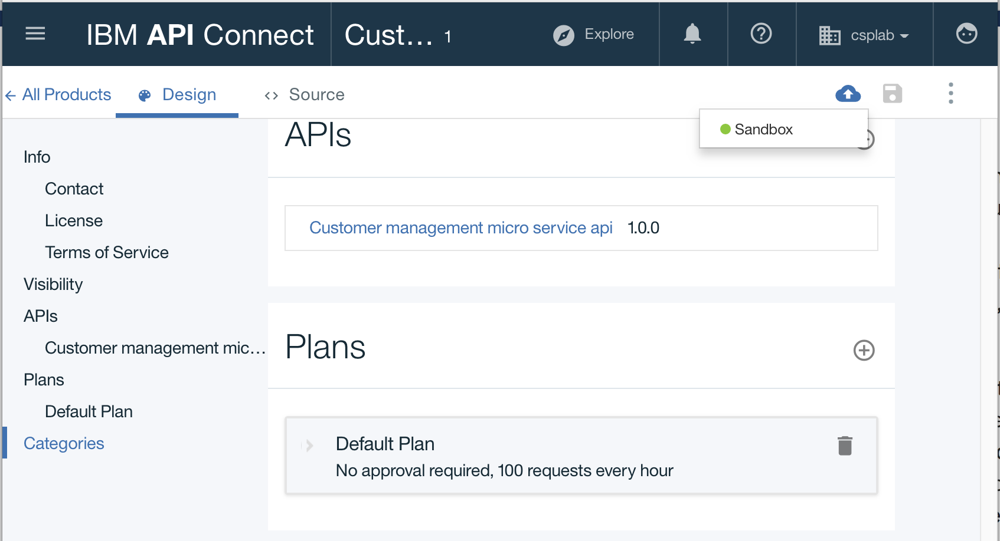

You can see from the figure above we select a default plan. In production you will define a plan according to business requirements. Publish the product to the catalog, you should be able to see the new URL for the API endpoint: (e.g. https://172.16.50.8/csplab/sb/customers)

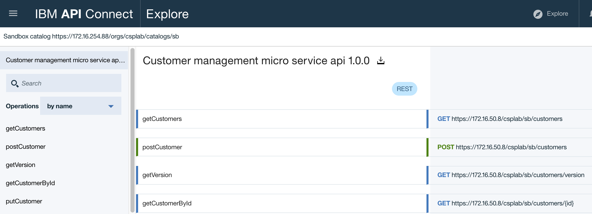

Once deployed developers can access the API Portal to define the application the developer will implement and that subscribed to this product.

## Step 5: Define application for developer
Using the portal at a URL like: https://172.16..../csplab/sb you can access to the API portal for developers.

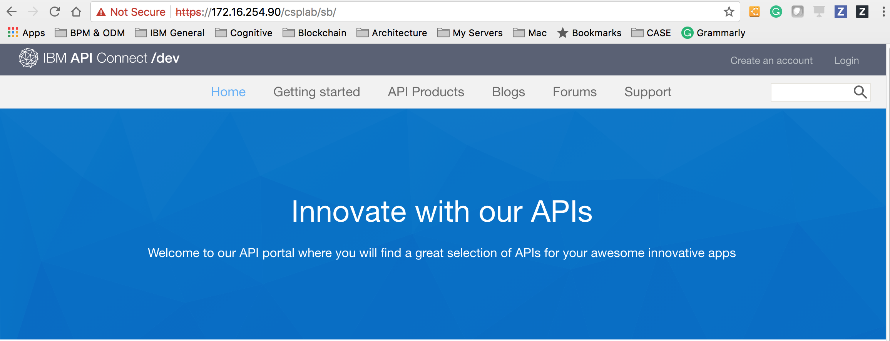

Developers have an account, and need to register their application before using an API.

When you register an application, the application is assigned a unique client ID and client secret. You must use the client ID when you call an API that requires you to identify your application by using a client ID.

### Create an application
In App menu, use `Create an application` button.   
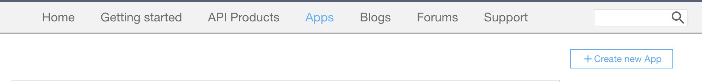

Specify a name
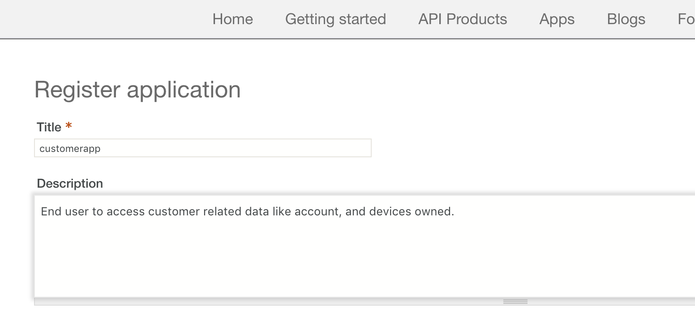

Then browse existing API products and select the customer API, then subscribe:

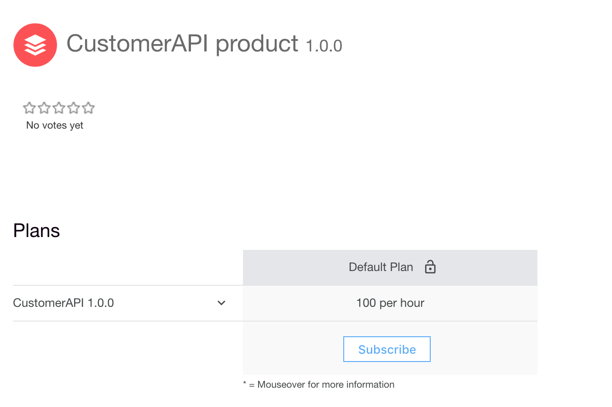

Now you should have a clientID to be used in future request from the application.

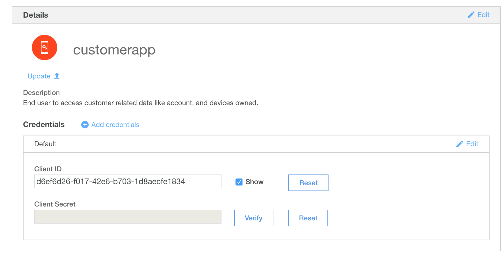

This client id needs to be part of the HTTP header for any request to the api. You should be able to do an integration test to validate the path API product deployed on gateway -> Java REST micro service on ICP -> DB2, using a tool like postman or SOAP UI. The following figure illustrates a GET request to the API URL to get a customer given its id, with the setting of the `X-IBM-Client-Id` in the HTTP header.

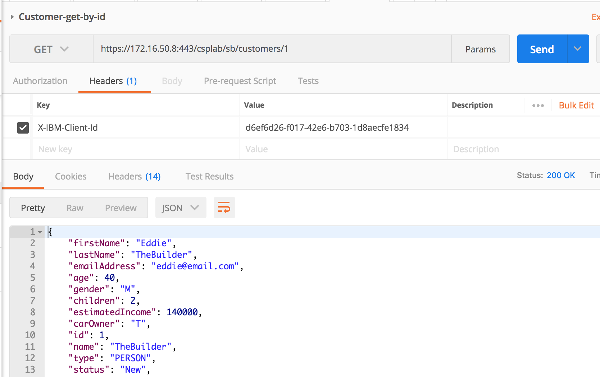
 Cool! we get the good answer.

### Modify consumer
The webapp we developed for the demonstration, needs to be update to integrate the HTTP header as below:

```javascript
var buildOptions=function(met,aPath,config)***REMOVED***
  return ***REMOVED***
    url: config.customerAPI.url+aPath,
    method: met,
    rejectUnauthorized: true,
    headers: ***REMOVED***
      accept: 'application/json',
      'Content-Type': 'application/json',
      'X-IBM-Client-Id': config.customerAPI.xibmclientid,
      Host: config.customerAPI.host,
    ***REMOVED***
  ***REMOVED***
***REMOVED***
getCustomerByEmail : function(config,req,res)***REMOVED***
  var opts = buildOptions('GET','/customers/email/'+req.params.email,config);
  opts.headers['Content-Type']='multipart/form-data';
  processRequest(res,opts);
***REMOVED***

```
and in the configuration file, we need to change the URL and add the new parameter:
```json
"customerAPI":***REMOVED***
    "url":"https://172.16.50.8:443/csplab/sb",
    "host":"customer.green.case",
    "xibmclientid": "***REMOVED***"
***REMOVED***
```
Remark: the host attribute is still needed if you do not have DNS resolution in the network where ICP, API gateway are running.


# Further readings
* Tutorial on the garage method https://cloudcontent.mybluemix.net/cloud/garage/demo/try-api-connect
* Brown compute specific API management best practices: https://github.com/ibm-cloud-architecture/refarch-integration-api#implementation-details
