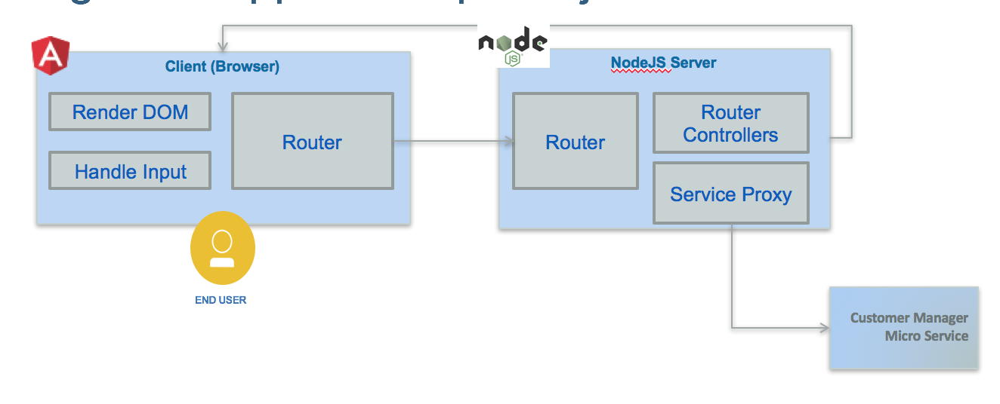

# Implementation explanation
## Web Application
### Code explanation
Most of the interactions the end users are doing on the Web Browser are supported by [Angular 4 single page](http://angular.io) javascript library, with its `router` mechanism and the DOM rendering capabilities via directives and components. When there is a need to access data to the on-premise server for persistence, an AJAX call is done to server, and  the server will respond asynchronously later on. The components involved are presented in the figure below in a generic way



From an implementation point of view we are interested by the router, the controller and the services.

To clearly separate the codebase for front-end and back-end the `src/client` folder includes angular 4 code while `src/server` folder includes the REST api implemented with expressjs.

## Angular app
The application code follows the standard best practices for Angularjs development:
* unique index.html to support single page application
* use of modules to organize features
* use of component, html and css per feature page
* encapsulate calls to back end for front end server via service components.

We recommend beginners one Angular to follow the [product "tour of heroes" tutorial here.](https://angular.io/tutorial)

### Main Components
As traditional Angular 4 app, you need:
*  a main.ts script to declare and boostrap your application.
* a app.module.ts to declare all the components of the application and the URL routes declaration. Those routes are internal to the web browser. They are protected by a guard mechanism to avoid unlogged person to access the page. The following code declares 3 routes for the three main features of this application: display the main top navigation page, the customer page to access account, and the itSupport to access the chat bot user interface. The AuthGard assess if the user is known and logged, if not it is routed to the login page.
 ```
 const routes: Routes = [
   { path: 'home', component: HomeComponent,canActivate: [AuthGuard]},
   { path: 'log', component: LoginComponent },
   //canActivate: [AuthGuard]
   { path: 'itSupport', component: ConversationComponent,canActivate: [AuthGuard]},
   { path: 'customer', component: CustomersComponent,canActivate: [AuthGuard]},
   // otherwise redirect to home
   { path: '**', redirectTo: 'home' }
 ]
 ```
* an app.component to support the main page template where routing apply. This component has the header and footer of the HTML page and the placeholder directly to support sub page routing:
 ```
    <router-outlet></router-outlet>
 ```

### Home page
The home page is just a front end to navigate to the different features. It persist the user information in a local storage and use the angular router capability to map widget button action to method and route.
For example the following HTML page use angular construct to link the button to the itSupport method of the Home.component.ts
```html
<div class="col-md-6 roundRect" style="box-shadow: 3px 3px 1px #05870b; border-color: #05870b;">
      <h2>Support Help</h2>
      <p>Get help</p>
      <p><button (click)="itSupport()" class="btn btn-primary">Ask me</button></p>
</div>
```

the method delegates to the routing based on url
```javascript
itSupport(){
  this.router.navigate(['itSupport']);
}
```
### Conversation bot
For the conversation front end we are re-using the code approach of the conversation broker of the [Cognitive reference architecture implementation](https://github.com/ibm-cloud-architecture/refarch-cognitive-conversation-broker)
The same approach, service and component are used to control the user interface and to call the back end. The service does an HTTP POST of the newly entered message.


### Customer component
For the customer the component in client/app/customer folder use a service to call the nodejs / expressjs REST services as illustrated in the code below:  

```javascript
export class CustomerService {
  private invUrl ='/api/c';

  constructor(private http: Http) {
  };

  getItems(): Observable<any>{
    return this.http.get(this.invUrl+'/customer')
         .map((res:Response) => res.json())
  }
}
```
The http component is injected at service creation, and the promise returned object is map so the response can be processed as json document.

An example of code using those service is the customer.component.ts, which loads the account during component initialization phase.

```javascript
export class CustomerComponent implements OnInit {

  constructor(private router: Router, private cService : CustomerService){
  }

  // Uses in init to load data and not the constructor.
  ngOnInit(): void {
    this.getProfile();
  }
}
```


## Server code
The application is using nodejs and expressjs standard code structure. The code is under `server` folder.
### Conversation back end.

### Customer back end
The customer API is defined in the server/routes/feature folder and uses request library to perform the call to the customer micro service API. The config.json file specifies the end point URL.

```javascript
const config = require('../env.json');
const apiUrl=config.secureGateway.url+config.apiGateway.url+"/items";

router.get('/items', function(req,res){
  console.log("In inventory get all the items from the exposed api");
  var h = {
    'X-IBM-Client-Id': config.apiGateway.xibmclientid,
    'Accept': 'application/json',
    'Authorization': 'Bearer '+req.headers.token
  }
  request.get(
      {url:apiUrl,
      timeout: 5000,
      headers: h
      },
      function (error, response, body) {

      }
     );

});

```
## Customer Micro service
