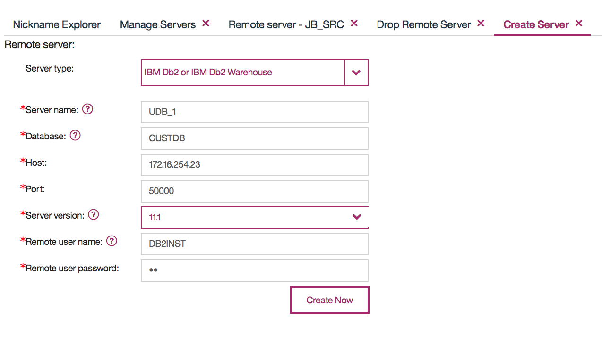
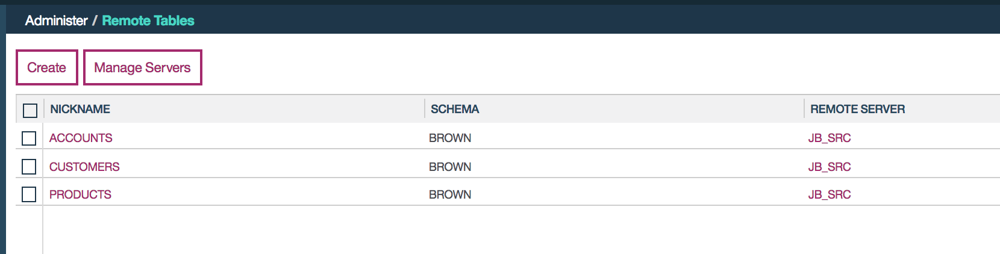
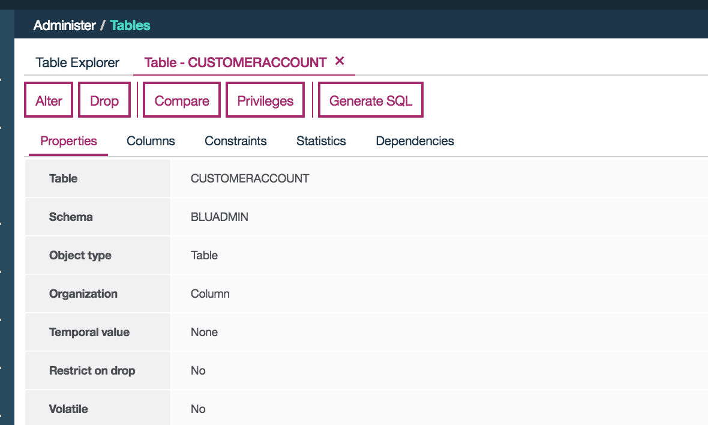

# Data Ingestion

For data ingestion we have multiple choices to move data from DB2 to Db2 warehouse, Cloudant to Db2 warehouse. The appraoch will depend of the number of records to load, the frequency of data movement, and the overall size. This data movement is motivated by the Data Scientist work to select the best algorithm to classify customers into churn or not.
For this solution we have used the following approach

* churn settings were done by marketing group on existing 3000 customer records.
* To develop in parallel the analytics model and database, microservice,... we used csv files to share the data, but in real life the data are in the DB2 CUSTDB instance,
* We stage the data to Db2 warehouse on ICP, and let the Data science uses this data source from his Jupyter notebook within DSX
* When the random forest model is done we assume the marketing will ask to do model evaluation on new added records every month.
* To move data we used the Db2 remote table feature to load the same data from Db2 and then do data preparation to customeraccount unique table used by the ML training and testing

## Loading the data using remote table

Connect to the DB2 warehouse running on ICP. Normally is by using the proxy server with the mapped port number. For example our deployment is https://172.16.40.131:31107/console. (If you want to know more on how we configure Db2 warehouse helm release see [this note](https://github.com/ibm-cloud-architecture/refarch-analytics/blob/master/docs/db2warehouse/README.md))).

Recall that to get the port number you can execute the command:
```
kubectl get --namespace db2-warehouse services db2-gc-ibm-db2warehouse-prod
```
Go to the console and choose `Administer > remote tables`. Since nothing had been defined yet it popped up and asked if you want to create a remote server. If something was already defined you would have to select "Manage Servers". Then you can "Create" and enter all the connection information.



If you go back to the "Nickname Explorer" tab or "Administer / Remote Tables" then you can select "Create" to add a reference to a remote table. Select the data source type (Db2) and the data source they come from (UDB_1, as named previously). Optionally you can choose to "test server" if you want to make sure the connection works. Click "Add Nicknames" and select the items from the list. Check the boxes and select "Update Local Schema" to change the schema name (in case there might be collisions - we chose BROWN). Now those three tables are available for local questions as BROWN.ACCOUNTS, BROWN.CUSTOMERS, and BROWN.PRODUCTS



You can now create a view, called BROWN.CUSTOMERACCOUNT which has no data in it but uses the remote tables created earlier.

```SQL
CREATE VIEW BROWN.CUSTOMERACCOUNT AS (
select id, name, firstname, lastname, emailaddress, age, gender, type,
status, children, estimatedincome, carowner, profession, churn, churnrisk,
zipcode, maritalstatus, mostdominanttone, accountnumber, longdistance,
longdistancebilltype, international, local, balance, usage, dropped,
paymentmethod, localbilltype, rateplan

from brown.customers c, brown.accounts a
where c.account_accountnumber = a.accountnumber
);
```
From this view create the new table that will be used by the data scientist and a Spark jobs.
```SQL
CREATE TABLE BLUADMIN.CUSTOMERACCOUNT LIKE BROWN.CUSTOMERACCOUNT;

INSERT INTO BLUADMIN.CUSTOMERACCOUNT
select id, name, firstname, lastname, emailaddress, age, gender, type,
status, children, estimatedincome, carowner, profession, churn, churnrisk,
zipcode, maritalstatus, mostdominanttone, accountnumber, longdistance,
longdistancebilltype, international, local, balance, usage, dropped,
paymentmethod, localbilltype, rateplan

from brown.customers c, brown.accounts a
where c.account_accountnumber = a.accountnumber
;

```

Please note that if a large number of rows was involved this insert could easily be too big to do like this.



# Compendium

* As we used remote table in this solution you can deep dive into *federated systems* from the product documentation: https://www.ibm.com/support/knowledgecenter/SS6NHC/com.ibm.data.fluidquery.doc/topics/cfpint01.html
