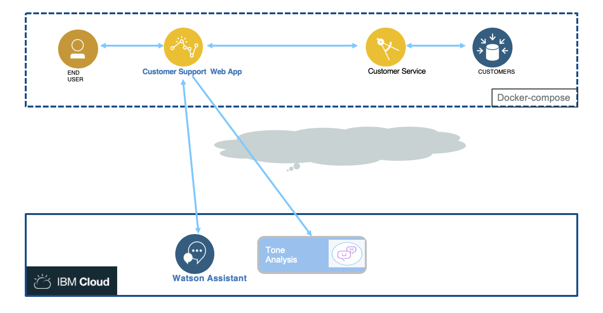

# Build and running local

This chapter addresses how to build and run the different component of the application. The approach is to use the cognitive services on IBM Cloud and docker-compose to run the difference service on your local laptop:



## pre-requisites

* For this application you need to have [nodejs](https://nodejs.org/en/) installed on your computer with the [npm](https://www.npmjs.com/) installer tool.
* You need a local docker engine
* You need docker-compose

## Configure DB2 customer tables

## Build

You can run a unique command to build all the components of the solution, and build their docker image, or you can build one service at a time. 

### Build the web app

* You need to install Angular command line interface if you do not have it yet: see the [cli.angular.io website](http://cli.angular.io) with the following command

 ```
 sudo  npm install -g @angular/cli
 ```

* If you want to tune the server code, you need to install [nodemon](https://nodemon.io/) to support server code change without stopping the server. The installation is done with `npm`:
```
sudo npm install -g nodemon
```

In this project run the command: `./scripts/build.sh`


### Build the customer service

In the project `refarch-integration-services` use `scripts/build.sh`

## Run

The solution runs with docker compose. Under the `docker` folder in this project do the following command:

```shell
docker-compose up &
```

