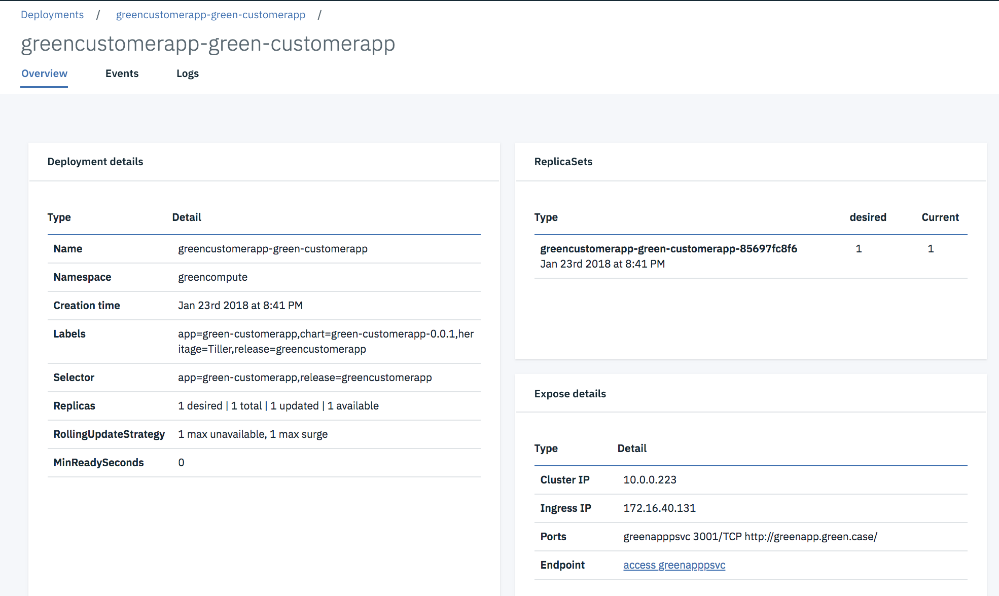

# Implementation details

In this chapter we are addressing the Angular 5 implementation and the Backend For Frontend as a nodejs app used to implement authentication, service orchestration, data mapping and to serve the Angular App. The BFF is also using Hystrix JS for circuit breaker and fault tolerance.

Update 08/2108 - Author [Jerome Boyer](https://www.linkedin.com/in/jeromeboyer/)

## Web Application

### Code explanation

Most of the end user's interactions are supported by [Angular 5 single page](http://angular.io) javascript library, with its `router` mechanism and the DOM rendering capabilities via directives and components. When there is a need to access data to the on-premise server for persistence, an AJAX call is done to server, and  the server will respond asynchronously later on. The components involved are presented in the figure below in a generic way:


From an implementation point of view we are interested by the router, the controller and the services.

To clearly separate the codebase for front-end and back-end the `src/client` folder includes Angular 5 code while `src/server` folder includes the REST api and BFF implemented with expressjs.

## Angular app

The application code follows the standard best practices for Angularjs development:
* unique index.html to support single page application
* use of modules to organize features
* use of component, html and css per feature page
* encapsulate calls to back end for front end server via service components.

We recommend Angular beginners to follow the [product "tour of heroes" tutorial](https://angular.io/tutorial). We also recommend to read our last work on Angular 5 app using a test driven development approach in [this project](https://github.com/ibm-cloud-architecture/refarch-caseportal-app).

### Main Components

As traditional Angular 5 app, you need:
*  a `main.ts` script to declare and bootstrap your application.
* a `app.module.ts` to declare all the components of the application and the URL routes declaration. Those routes are internal to the web browser. They are protected by a guard mechanism to avoid unlogged person to access some private pages. The following code declares four routes for the four main features of this application: display the main top navigation page, the customer page to access account, and the itSupport to access the chat bot user interface. The AuthGard component assesses if the user is known and logged, if not he/she is routed to the login page.
 ```
 const routes: Routes = [
   { path: 'home', component: HomeComponent,canActivate: [AuthGuard]},
   { path: 'log', component: LoginComponent },
   //canActivate: [AuthGuard]
   { path: 'itSupport', component: ConversationComponent,canActivate: [AuthGuard]},
   { path: 'customer', component: CustomersComponent,canActivate: [AuthGuard]},
   // otherwise redirect to home
   { path: '**', redirectTo: 'home' }
 ]
 ```
* an `app.component` to support the main page template where routing is done. This component has the header and footer of the HTML page and the placeholder directly to support sub page routing:
 ```
    <router-outlet></router-outlet>
 ```

### Home page

The home page is just a front end to navigate to the different features. It persists the user information in a local storage and uses the Angular router capability to map widget button action to method and route.
For example the following HTML page uses angular construct to link the button to the `itSupport()` method of the Home.component.ts
```html
<div class="col-md-6 roundRect" style="box-shadow: 3px 3px 1px #05870b; border-color: #05870b;">
      <h2>Support Help</h2>
      <p>Get help</p>
      <p><button (click)="itSupport()" class="btn btn-primary">Ask me</button></p>
</div>
```

the method delegates to the angular router with the 'itSupport' url
```javascript
itSupport(){
  this.router.navigate(['itSupport']);
}
```
### Conversation bot

For the conversation front end we are re-using the code approach of the conversation broker of the [Cognitive reference architecture implementation](https://github.com/ibm-cloud-architecture/refarch-cognitive-conversation-broker).
The same approach, service and component are used to control the user interface and to call the back end. The service does an HTTP POST of the newly entered message:
```
export class ConversationService {
  private convUrl ='/api/c/conversation/';

  constructor(private http: Http) {
  };

  submitMessage(msg:string,ctx:any): Observable<any>{
    let user = JSON.parse(sessionStorage.getItem('currentUser'));
    let bodyString = JSON.stringify(  { text:msg,context:ctx,user:user });

    let headers = new Headers({ 'Content-Type': 'application/json' });
    let options = new RequestOptions({ headers: headers })
    return this.http.post(this.convUrl,bodyString,options)
         .map((res:Response) => res.json())
  }
}
```

So it is interesting to see the message as the watson conversation context and the user basic information.

### Account component

When the user selects to access the account information, the routing is going to the account component in `client/app/account` folder use a service to call the nodejs / expressjs REST services as illustrated in the code below:  

```javascript
export class CustomerService {
  private invUrl ='/api/c';

  constructor(private http: Http) {
  };

  getItems(): Observable<any>{
    return this.http.get(this.invUrl+'/customer')
         .map((res:Response) => res.json())
  }
}
```
The http component is injected at service creation, and the promise returned object is map so the response can be processed as json document.

An example of code using those service is the `account.component.ts`, which loads the account during component initialization phase.

```javascript
export class AccountComponent implements OnInit {

  constructor(private router: Router, private cService : CustomerService){
  }

  // Uses in init to load data and not the constructor.
  ngOnInit(): void {
    this.user = JSON.parse(localStorage.getItem('currentUser'));
    if(this.user && 'email' in this.user) {
      cService.getCustomerByEmail(this.user.email).subscribe(
          data => {
            this.customer=data;
          },
          error => {
            console.log(error);
          });
    }
  }
}
```

## Server code

The application is using nodejs and expressjs standard code structure. The code is under `server` folder.

### Conversation back end

The script is in `server/route/features/chatBot.js` and uses the Watson developer cloud library to connect to the remote service. This library encapsulates HTTP calls and simplifies the interactions with the public service. The only thing that needs to be done for each chat bot is to add the logic to process the response, for example to get data from a backend, presents user choices in a form of buttons, or call remote service like a rule engine / decision service.

This module exports one function to be called by the API used by the front end. This API is defined in `api.js` as:
```javascript
app.post('/api/c/conversation',isLoggedIn,(req,res) => {
  chatBot.chat(config,req,res)
});
```

The `chatBot.chat()` method gets the message and connection parameters and uses the Watson API to transfer the call. The set of if statements are used to perform actions, call services, using the variables set in the Watson Conversation Context. One example is to use the Operational Decision Management rule engine to compute the best product for a given customer situation.

```javascript
chat : function(config,req,res){
  req.body.context.predefinedResponses="";
  console.log("text "+req.body.text+".")
  if (req.body.context.toneAnalyzer && req.body.text !== "" ) {
      analyzeTone(config,req,res)
  }
  if (req.body.context.action === "search" && req.body.context.item ==="UserRequests") {
      getSupportTicket(config,req,res);
  }
  if (req.body.context.action === "recommend") {
      odmclient.recommend(config,req.body.context,res, function(contextWithRecommendation){
        req.body.context = contextWithRecommendation;
        sendToWCSAndBackToUser(config,req,res);
      });
  }
  if (req.body.context.action === "transfer") {
      console.log("Transfer to "+ req.body.context.item)
  }

  if (req.body.context.action === undefined) {
      sendToWCSAndBackToUser(config,req,res);
  }
} // chat
```


The send message uses the Watson developer library:
```javascript

  conversation = watson.conversation({
          username: config.conversation.username,
          password: config.conversation.password,
          version: config.conversation.version,
          version_date: config.conversation.versionDate});

  conversation.message(
      {
      workspace_id: wkid,
      input: {'text': message.text},
      context: message.context
      },
      function(err, response) {
        // add logic here to process the conversation response
      }
    )
```
It uses content of the conversation context to drive some of the routing mechanism. This code supports the following sequencing:


* As the user is enquiring about an existing ticket support, the conversation set the action variable to "search", and return a message in "A" that the system is searching for existing records. The web interface send back an empty message on behave of the user so the flow can continue.

* If the conversation context has a variable action set to "search", it calls the corresponding backend to get other data. Like a ticket management app. We did not implement the ticket management app, but just a mockup.

 ```javascript
 if (req.body.context.action === "search" && req.body.context.item ==="UserRequests") {
  ticketing.getUserTicket(config,req.body.user.email,function(ticket){
      if (config.debug) {
          console.log('Ticket response: ' + JSON.stringify(ticket));
      }
      req.body.context["Ticket"]=ticket
      sendToWCSAndBackToUser(config,req,res);
  })}
 ```
 The ticket information is returned to the conversation directly and the message response is built there.
* if the action is "recommend", the code can call a decision service deployed on IBM Cloud and execute business rules to compute the best recommendations/ actions. See example of such approach in [the project "ODM and Watson conversation"](https://github.com/ibm-cloud-architecture/refarch-cognitive-prod-recommendations)
* If in the conversation context the boolean `toneAnalyzer` is set to true, then any new sentence sent by the end user will be sent to Watson Tone Analyzer.
```javascript
if (req.body.context.toneAnalyzer && req.body.text !== "" ) {
    analyzeTone(config,req,res)
}
```
* When the result to the tone analyzer returns a tone as `Sad or Frustrated` then a call to a churn scoring service is performed.
```javascript
function analyzeTone(config,req,res){
  toneAnalyzer.analyzeSentence(config,req.body.text).then(function(toneArep) {
        if (config.debug) {console.log('Tone Analyzer '+ JSON.stringify(toneArep));}
        req.body.context["ToneAnalysisResponse"]=toneArep.utterances_tone[0].tones[0];
        if (req.body.context["ToneAnalysisResponse"].tone_name === "Frustrated") {
          churnScoring.scoreCustomer(config,req,function(score){
                    req.body.context["ChurnScore"]=score;
                    sendToWCSAndBackToUser(config,req,res);
              })
        }
  }).catch(function(error){
      console.error(error);
      res.status(500).send({'msg':error.Error});
    });
} // analyzeTone
```

* when the churn score is greater than a value the call is routed to a human. This is done in the conversation dialog and the context action is set to Transfer
```javascript
if (req.body.context.action === "transfer") {
  console.log("Transfer to "+ req.body.context.item)
}
```
See also how the IBM Watson conversation is built to support this logic, in [this note.](../wcs/README.md)

Finally this code can persist the conversation to a remote document oriented database. The code is in `persist.js` and a complete detailed explanation to setup this service is in [this note.](../persist/chattranscripts.md)

### Customer back end

The customer API is defined in the server/routes/feature folder and uses the request and hystrix libraries to perform the call to the customer micro service API. The `config.json` file specifies the end point URL.

The Hystrixjs is interesting to use to protect the remote call with timeout, circuit breaker, fails quickly.... modern pattern to support resiliency and fault tolerance.

```javascript
var run = function(config,email){
  return new Promise(function(resolve, reject){
      var opts = buildOptions('GET','/customers/email/'+email,config);
      opts.headers['Content-Type']='multipart/form-data';
      request(opts,function (error, response, body) {
        if (error) {reject(error)}
        resolve(body);
      });
  });
}

// times out calls that take longer, than the configured threshold.
var serviceCommand =CommandsFactory.getOrCreate("getCustomerDetail")
  .run(run)
  .timeout(5000)
  .requestVolumeRejectionThreshold(2)
  .build();

getCustomerDetail : function(config,email) {
    return serviceCommand.execute(config,email);
}

```

### Churn risk scoring

The scoring is done by deploying a trained model as a service. We have two clients, one for Watson Data Platform and one for Spark cluster on ICP.
The interface is the same so it is easy to change implementation.

### Helm chart

We created a new helm chart for this application with
`helm create greencompute-telco-app`.
Then we update the following:
* Add a configMap.yaml file under the templates to defined the parameters used to configure the service end point metadata used by the BFF code.
* Add a volume in the deployment.yaml to use the parameters from the configMap. and mount this volume into the file. And modify the port mapping  
```
spec:
  volumes:
    - name: config
      configMap:
        name:  {{ template "greencompute-telco-app.fullname" . }}
  containers:
    - name: {{ .Chart.Name }}
      image: "{{ .Values.image.repository }}:{{ .Values.image.tag }}"
      imagePullPolicy: {{ .Values.image.pullPolicy }}
      ports:
        - containerPort: {{ .Values.service.internalPort }}
      volumeMounts:
        - name: config
          mountPath: /greenapp/server/config/config.json
          subPath: config.json
```
* In values.yaml set the docker image name
* Modify the value to use service.port to be externalPort and set it to match the one exposed in dockerfile:
```
service:
  type: ClusterIP
  externalPort: 3001
  internalPort: 3001
```
* enable ingress and set a hostname (telcoapp.green.case)
* In the ingress use the servicePort to map the externalPort.
```
{{- $servicePort := .Values.service.externalPort -}}
```
* In the service.yaml be sure to define the ports well using the one set in values.yaml
```
ports:
  - port: {{ .Values.service.externalPort }}
    targetPort: {{ .Values.service.internalPort }}
    protocol: TCP
    name: {{ .Values.service.name }}
```


### ICP deployment

For this web application we are following the same steps introduced within the [Brown Case Web app application](https://github.com/ibm-cloud-architecture/refarch-caseportal-app/blob/master/docs/icp/README.md) and can be summarized as:
* Compile the app: `ng build`
* Create docker images: `docker build -t ibmcase/greencompute-telco-app  . `
* We are now using public dockerhub so just we are doing a `docker push ibmcase/greencompute-telco-app`
* When deploying to a private registry as the one internal to ICP, tag the image with the docker repository name, version: `docker tag ibmcase/greencompute-telco-app  greencluster.icp:8500/greencompute/greencompute-telco-app`, then push the docker images to the docker repository running on the Master node of ICP:
```
$ docker login greencluster.icp:8500
$ docker push greencluster.icp:8500/greencompute/greenapp:v0.0.2
```

* Be sure to be connected to the kubernetes server with commands like:
```
bx pr login -u admin -a https://greencluster.icp:8443 --skip-ssl-validation
bx pr cluster-config greencluster.icp
```
* Install the Helm release with the greencompute namespace: `helm install  greencompute-telco-app/ --name green-telco-app --namespace greencompute`



* Be sure you have name resolution from the hostname you set in values.yaml and IP address of the ICP proxy. Use your local '/etc/hosts' file for that. In production, set your local DNS with this name resolution.

* Test by accessing the URL: `http://http://greenapp.green.case/`


## Customer Microservice

The back end customer management function is a micro service in its separate repository, and the code implementation explanation can be read [here.](https://github.com/ibm-cloud-architecture/refarch-integration-services#code-explanation)

## More readings

* [Angular io](https://angular.io/)
* [Hystrixjs the latency an fault tolerance library](https://www.npmjs.com/package/hystrixjs)
* Javascript Promise chaining [article](https://javascript.info/promise-chaining)
* [Case Portal app using Angular 5 app using a test driven development approach in [this project](https://github.com/ibm-cloud-architecture/refarch-caseportal-app)
