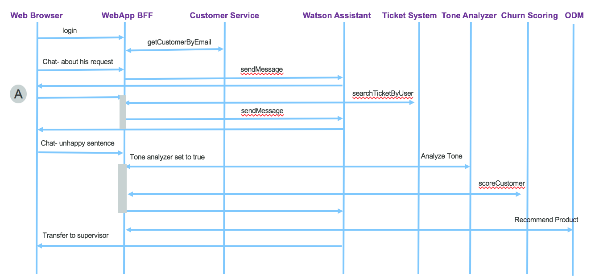

# Design considerations

## System Context diagram

The following diagram illustrates the system context of the application, including analytics model preparation and run time execution.

This repository presents best practices to deploy such solution on public and private cloud, implements the webapp deployable in public or private cloud, and deliver example of data sets.

## Components

From above figure left to right the components involved are:

1. **Web application** to offer a set of services for the end user to access: from this user interface the end user, customer of Green Telco, can access his account, pays his bill (not implemented) and uses the chat bot user interface to get support help. [This note](code.md) presents the implementation details and how to deploy it on ICP.
1. The account informations are loaded from the back end systems (7) via a customer management micro service (8) and an API product defined (9) in API Connect. The call in (2) is RESTful API and documented in [this note](code.md#account-component)
1. The chat bot is implemented with **Watson Assistant**. The workspace is delivered for you to upload to your own Watson Assistant cloud service you may have created, [this note](../wcs/README.md) go into the implementation detail.
1. Conversation sentences may be analyzed for **tone analysis**, and natural language understanding, those data are used by the scoring service. The service creation in IBM Cloud and the integration into the application flow is explained in [this note](w-tone-analyzer.md)
1. The conversation transcripts are persisted in a document oriented database. We discuss about its implementation with Cloudant service on IBM Cloud in [this technical note.](../persist/chattranscripts.md)
1. A **scoring service** to assess current risk of churn for the customer interacting with Green Telco services. This is a runtime analytics service using customer data and results from the Tone Analysis. [This note](scoring-serv.md) goes over the detail of the deployment and implementation of this machine learning based service. It can be deployed on IBM Cloud public Watson Machine learning or IBM Cloud Private.
1. The customer [data](https://github.com/ibm-cloud-architecture/refarch-integration-services#data-model) are persisted in on-premise server with relational database. We are using DB2 on-premise server for that. To read how the database was created see [the note in this repository](https://github.com/ibm-cloud-architecture/refarch-integration-services/blob/master/docs/DB2Creation.md)
1. Customer data are exposed via a **micro service** approach. The implementation is done in a separate repository: [the Customer management micro-services](https://github.com/ibm-cloud-architecture/refarch-integration-services). It supports the JAXRS implementation deployed in Liberty as Docker image and the DB2 schema for DB2 data base.
1. **API product** can be defined on top of the customer management service to monitor API usage and perform API governance. The implementation is supported by IBM API Connect. Some explanation of the product development in [this note](../apim/README.md)   
At this stage the other components are more used at design time with the involvement of knowledge engineers, data analysts and data scientists.
1. Data scientists use machine learning library and Jupiter notebook, R Studio or Zeppelin on top of Apache Spark in IBM Data Science Experience (DSX) to discover the model. We are documenting two different approaches:
   * One based on Watson Data Platform running on IBM Cloud and described in [this note](../ml/README.md) with [this jupyter notebook](../ml/CustomerChurnAnalysisCl-bpull.md).
   * One based on [Private cloud using DSX and Db2 warehouse](../ml/icp-dsx-ml-model.md) and [another notebook](../ml/CustomerChurnAnalysisDSXICP.md).
1. The data used by data scientists are persisted in Db2 warehouse. [This note](https://github.com/ibm-cloud-architecture/refarch-analytics/tree/master/docs/db2warehouse) goes over the creation of the Db2 warehouse release within IBM Cloud private.
1. **Ingestion** mechanism can move data, for chat transcripts and customer records to the DB2 warehouse. This process can run on demand when Data Scientists need new data to tune the model. It can be implemented with an ETL, with Java program, or using the Db2 Federation capability. [This note](../data/README.md) explains what was done to move DB2 customer data to Db2 warehouse.
1. [Product recommendations based on Operational Decision Management rules](https://github.com/ibm-cloud-architecture/refarch-cognitive-prod-recommendations)

The natural language understanding service is added to support most advanced language processing from the text entered but the end user: entity extraction, relationships, taxonomy, etc. Those elements could be used for scoring services. The language understanding can be fine-tuned by using terms and model defined in **Watson Knowledge Studio**.

The following sequence diagram explains how the components interact with each others.

