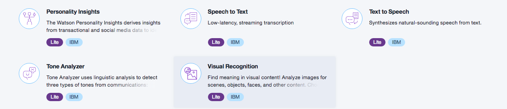
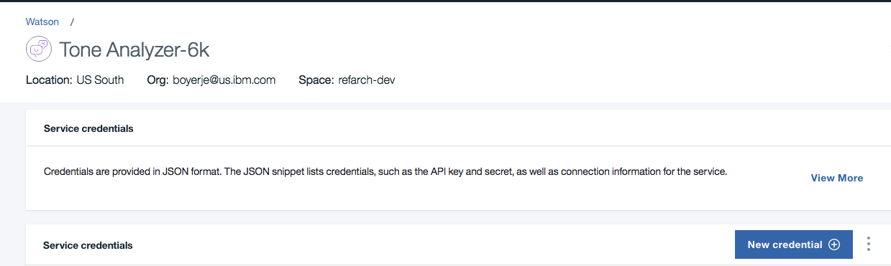

# Watson Tone Analyzer integration

For integrating Watson Tone Analyzer inside your application flow, you need to create a Watson Tone Analyzer service, get the credential and develop a client code to connect to your application flow.

## 1- Create the Watson Tone Analyzer service

To create the service, login to IBM Cloud and navigate the catalog to Watson category, under `Platform`, select Tone Analyzer, select the region, organization and space to attach the service to, and then `create`



## 2- Access the credentials

Select your newly created service and go to the Service credentials to define new configuration for remote connect to the service:



Copy those credential into the `src/server/config/config.json` file and into the `chart/values.yaml` file.

```json
"toneAnalyzer":{
    "url": "https://gateway.watsonplatform.net/tone-analyzer/api",
    "versionDate": "2017-09-21",
    "username": "3",
    "password": "z"
},
```

## 3- Client code

The client code is already coded and can be seen in `src/server/routes/features/toneAnalyzer.js` it basically uses the Watson developer client modules to access the service. The only thing to consider is what are the utterances. In our case the last sentence entered by the end user is the unique utterance. The alternate choice is to accumulate the last n sentences and add them in the array of utterances. So the service will use more content to assess the global tone of the user.

```javascript
var ToneAnalyzerV3=require('watson-developer-cloud/tone-analyzer/v3');
//...
analyzeSentence : function(config,message,res){
    return new Promise(function(resolve, reject){
        var tone_analyzer = new ToneAnalyzerV3(buildOptions(config));
        var params = {
          utterances: [{"text":message}]
        };
        //...
      })}
```

## Integration

As explained in the [code explanation note](code.md) when the designer of the conversation dialog flow decides a speciic conversation subject / intent is becoming sensitive, he may set parameters in the conversation context to trigger calls to tone analyzer for any sub sequent interactions.

The conversation context boolean `toneAnalyzer` is used for that, and set to true, so any new sentence sent by the end user will be routed to Watson Tone Analyzer.
```javascript
if (req.body.context.toneAnalyzer && req.body.text !== "" ) {
    toneAnalyzer.analyzeSentence(config,req.body.text).then(function(toneArep) {
      // ...
    })
}
```

The returned json object is added to the context too, so it can be used for any other call to back end services, like the churn risk scoring.
Here is an example of outcome:
```json
{"utterances_tone":
    [{"utterance_id":0,
      "utterance_text":"what? the sale rep told me it will be free, this is a scandal very frustrating, what can be done?",
      "tones":[
          {"score":0.651769,
           "tone_id":"frustrated",
           "tone_name":"Frustrated"}]
    }]
}
```
