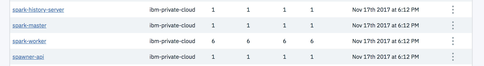

# IBM Cloud Private environment

If you want setting up the environment on your own you will need at least seven VMs:

* One ICP cluster with at the bare minimum of three VMs: one master-proxy node, two worker nodes. This is for the run time. 
* For the machine learning part, we propose to use a dedicated IBM Cloud Pak for data, with four nodes: ne master-proxy node, three worker nodes.
* One VM for DB2 community edition and liberty server

In production, you will use a high availability clusters with 3 masters, 3 managements, 3 proxy, at least 4 worker nodes per ICP clusters.

## Installing IBM Cloud Private

You can study [this website](https://github.com/ibm-cloud-architecture/refarch-privatecloud) and reuse the  [Terraform file](https://github.com/ibm-cloud-architecture/terraform-module-icp-deploy) to configure your environment.

## Installing IBM Cloud Pack for Data

We do not plan to add yet another step by step instruction for installing ICP4D. The product installation instructions are at [https://docs-icpdata.mybluemix.net/install/com.ibm.icpdata.doc/zen/install/standovu.html](https://docs-icpdata.mybluemix.net/install/com.ibm.icpdata.doc/zen/install/standovu.html)

and to prepare VMs see [this note](https://docs-icpdata.mybluemix.net/install/com.ibm.icpdata.doc/zen/install/reqs-ent.html)

## The ICP run time clustering

The following diagram illustrates the ICP cluster topology with some of the major ICP components:

The dashed lines highlight the deployment concept of k8s. The Db2 warehouse is using external `Glusterfs` cluster for persisting data via the persistent volumes and persistent volume claim.

The spark cluster, master, spawner... are deployments inside ICP and installed via DSX Local.  

