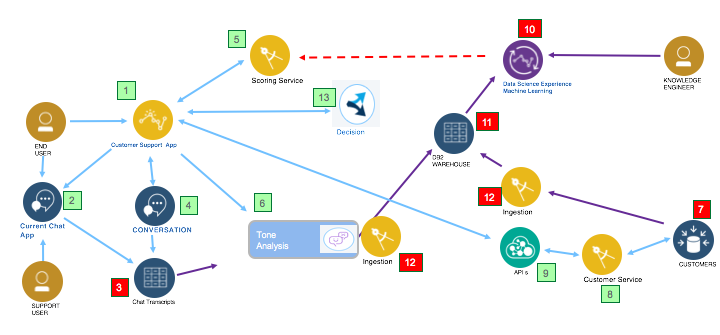
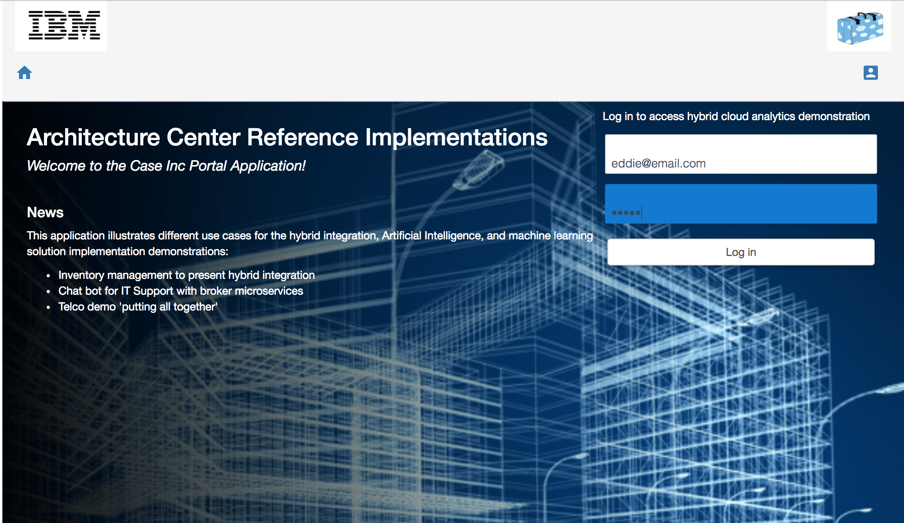
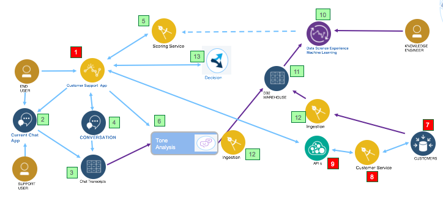
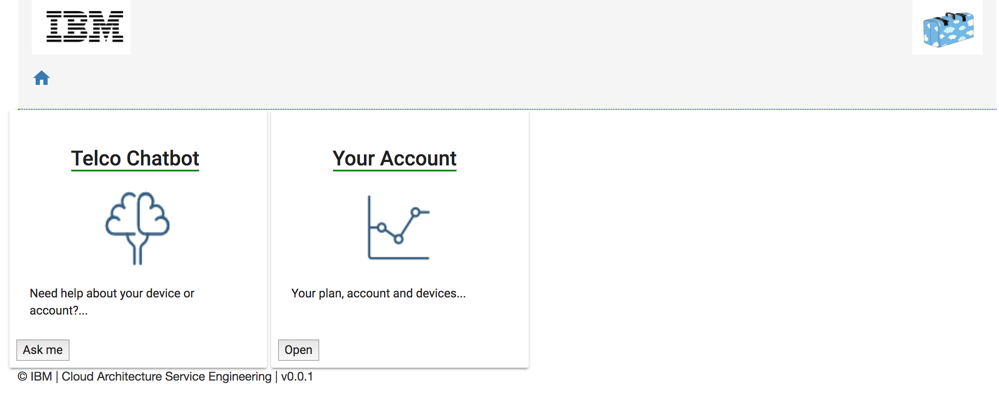
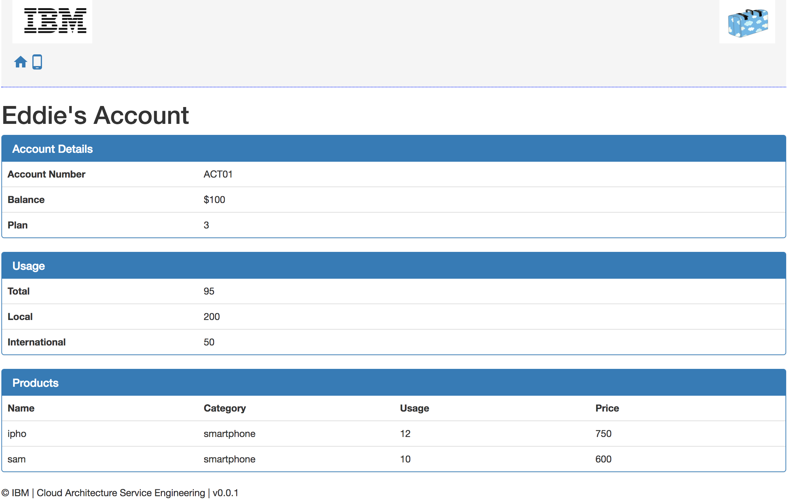
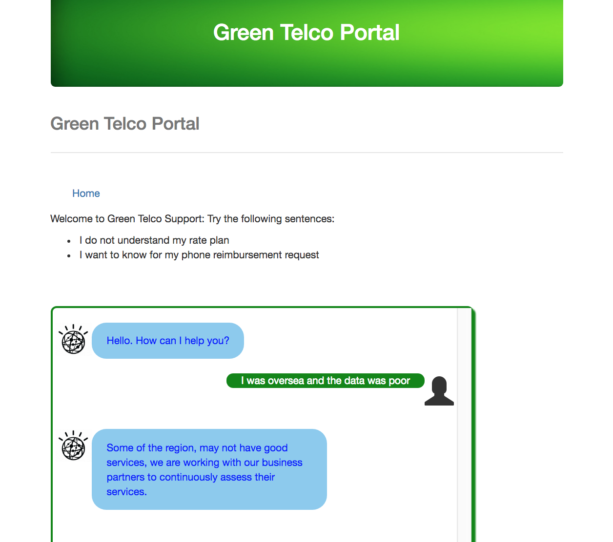
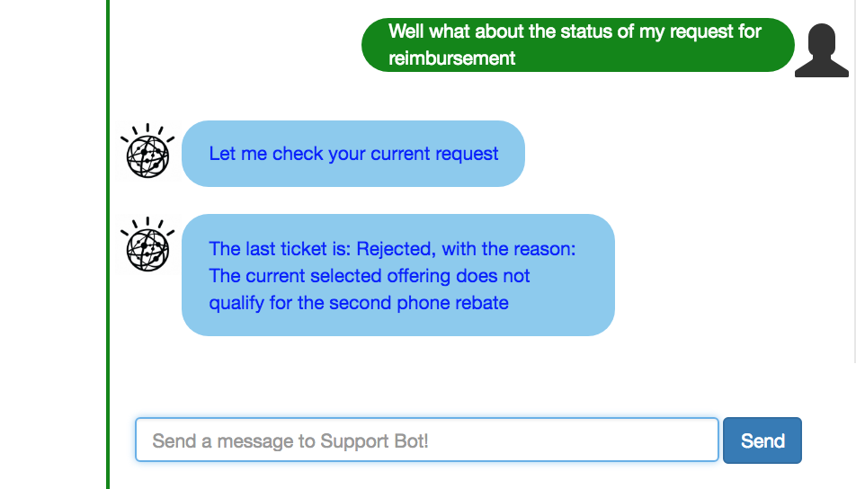
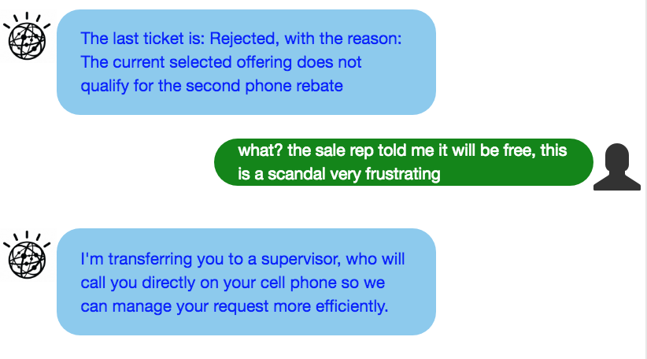
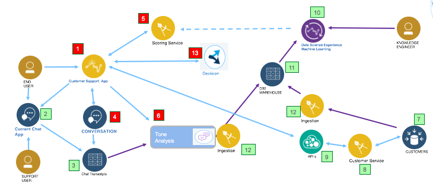

# Demonstration Script
There are two paths to demonstrate, the model creating, focusing on analytics work from at-rest data, and the end user view of the application.

## Training the Machine Learning Model
Customer Information, that is persisted in DB2 running on Z or Db2 server, contains customer’s personal information like age, gender, profession, family, income, and account information like service usage, rate plan and device owned. This is item [7] in diagram below:

 The data model can be seen [here](https://github.com/ibm-cloud-architecture/refarch-integration-services#data-model).

Customer Information is currently planned to run and be maintained on system Z.

An Extract Transform Load job, or other script running on-premise ingests customer information from DB2 running on mainframe into the DB2 Warehouse running on IBM cloud private on Z. Items [12] in diagram above. (Alternatively, IBM Information Server products can be used to move data). We have also used the Db2 Warehouse 'remote tables' features to remote connect to the DB2 table (see [this note](../data/README.md) for details).
The current implementation is using a Java based implementation of the customer service, using a micro service approach, see the explanation in [this project](https://github.com/ibm-cloud-architecture/refarch-integration-services)

IBM Watson Studio running on ICP uses the data persisted in DB2 Warehouse (Item [11]) to train a model to predict customer churn (Item [10]). The machine learning / jupyter notebook explanations are in [this note]().

In addition, past customer voice records maintained in a file system is cleansed by a cloud native application running on IBM Cloud Private. The cleansed information is then transcribed using IBM Watson Speech to Text running on IBM Public cloud. The transcribed information is persisted on IBM Cloudant database (Item [3]) running on IBM public cloud.

IBM Knowledge Studio is used to create custom models to understand the content that is part of the voice chat records.

The transcribed information is then used by Watson NLU running on public cloud that uses the custom model from Knowledge Studio to gain understanding of the content. In parallel Watson Tone Analyzer uses the tone to understand the tones from past historical transcripts.
The use of Watson NLU and the Tone Analyzer is orchestrated by a cloud native app running in IBM cloud private.  The output of NLU and Tone Analyzer is combined and stored in Cloudant DB running on public cloud.

IBM DSX running on IBM Watson Data Platform in IBM public cloud catalogs the content from IBM Cloudant (IBM NLU and Tone Analyzer information extracted) and the DB2 Warehouse information and builds a new ML model. This model is deployed on IBM Watson ML running on ICP. Now we have trained model to predict customer churn

## Predicting Customer Churn
In this scenario, the following items can be demonstrated:
* Eddie logs on to the `Green Telco portal` application built as a Microservice and running on IBM Cloud Private. The userid is `eddie@email.com`.

*Note that the screen capture comes from the Case portal App. The current project has another version of the user interface*

Using the customer id (eddie@email.com) from the login, the app invokes the `Get Customer Detail API` from the back end to load customer and account data. There are two implementations for this API. One using direct access to a Java based service, and another using API Connect and Z OS Connect to retrieve the customer information. The loaded information is collected by the App in memory. The figure below highlights the flow:  

From the home page, user can access his/her account or the chat bot:

The account information comes from the backend database:   

* Eddie complains about the poor quality of data and chat service while he was overseas. He enters the sentence: "I was oversea and the data was poor"

  

Eddie also asking about the status of his reimbursement request, with the phrase: "Well what about the status of my request for reimbursement"

The bot returns the status of the last ticket: it is rejected. Eddie is not very happy and complains about it: ""

The chat transcript from Eddie is sent to Tone Analyzer and NLU which then determines the sentiment and tone. Using the sentiment and the tone it is determined that Eddie is  "Frustrated".

The chatbot application then invokes the customer churn service which uses the ML model to determine that the customer is not a happy customer and has been with the Telco for 2 years.
The figure below illustrates this new flow:

Eddie has a genuine problem and deserves a senior call center rep or a supervisor. Eddie is the type of customer the Telco does not want to loose. The application then asks Eddie for a number and the supervisor calls Eddie and clarifies and resolves Eddies issues.

## Eddie wants to move
The conversation is running differently now, as Eddie wants to reallocate. He may have an IPTV and ADSL products at home, and the bot is asking for his new zip code to compute a new product recommendation and take into account his existing products, the new area coverage and the churn risk score to apply a discount.

The dialog flow looks like below:

