# Customer Churn Analytics using IBM Data Science Experience and Watson Data Platform

## Introduction and Background

This section outlines the steps to build and deploy an analytical model for predicting customer churn, using the combination of tooling in Watson Data Platform (WDP), and IBM Data Science Experience (DSX). The steps involve gathering data from various sources, aggregating them using Jupyter notebooks, building and training an analytical model, and finally deploying it on Watson Data Platform.

The overall system context for Watson Data Platform part of the solution is outlined in the following picture.

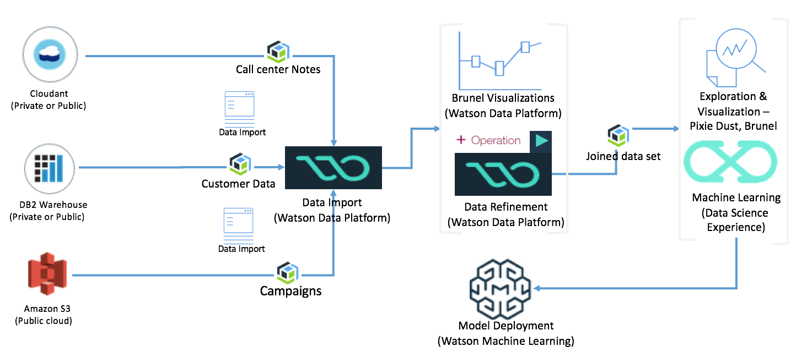

For a pure DSX and Db2 Warehouse and Spark cluster inside ICP approach the high level view looks like:

For the purposes of this exercise, this section shows similar operations (like filling missing values in the dataset) both in WDP and DSX. The reason is to illustrate the capabilities and the art of the possible.

The solution involves three datasets from the analytics standpoint, as outlined below:

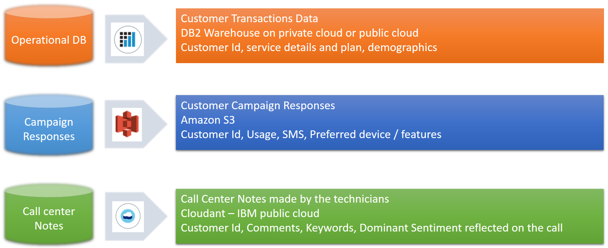

1. **Customer Transaction Data**: This data contains the customer's personal information and demographics (age, marital status, income etc.), and the subscription related details (such as phone model, plans, bill type etc.). This information is stored in a DB2 Warehouse database on cloud.
2. **Customer campaign results**: This dataset includes the results of a marketing campaign conducted by a third part marketing firm for the Telco customers. This is intended to capture the customer's preferred device or feature (such as large display, Android phone etc.) and usage related aspects such as if the customer has multiple phone numbers, and the number of SMS text messages the customer exchanges with his contacts. The notion is, the usage model and preferences, could have a strong influence in any given customer's preference to stay with the provider or leave. As per the scenario in this solution, this data is stored in the data servers of the marketing firm, which is on a third party cloud. The marketing firm makes this dataset available on Amazon S3.
3. **Call center notes**: This dataset contains a short, summary style description of customer's complaint, two or three important keywords showing the device, feature, and the problem, and the sentiment shown by the customer. In some cases customers simply ask questions such as where the nearest store is. These kinds of entries may have no value for sentiments. These need to be fixed before one can perform analytics. This dataset resides in Cloudant on IBM cloud. Since each customer complaint is a service ticket, which essentially is a document, this data is stored in Cloudant.

The steps will be mostly aligned with CRISP-DM methodology, focusing on the data preparation and analytics.

## Prerequisites

Before beginning the exercise, make sure you have accounts in the following systems.

1. [IBM Cloud](http://www.bluemix.net)
2. [Watson Data Platform](http://dataplatform.ibm.com)
3. [IBM Data Science Experience](http://datascience.ibm.com) - If you register for access in Watson Data Platform, you will get access to IBM data science experience. As an alternate use the DSX on IBM Cloud Private instance.

The datasets used in this exercise are shown in the data subfolder of this github repository. It is assumed you know how to create instances of services on IBM Cloud (Cloudant, DB2 Warehouse), and Amazon S3. Those steps are not outlined in the following sections, and for guidance with those services, the user is advised to check the documentation.

Chrome and Firefox are tested for this exercise and for the examples shown here. Other browsers may or may not work. It is left to the user to check and make sure.

## Data Import

Ingestion of data from different data sources requires creating connection to the data sources, and importing the datasets. Preparation of data involves operations inside Data Refinery using the shaper tool. Part of the data preparations are also shown inside DSX.

To begin with, open IBM Watson Data Platform (henceforth in this document referred to as WDP) using a browser. The main screen should show something like the following:

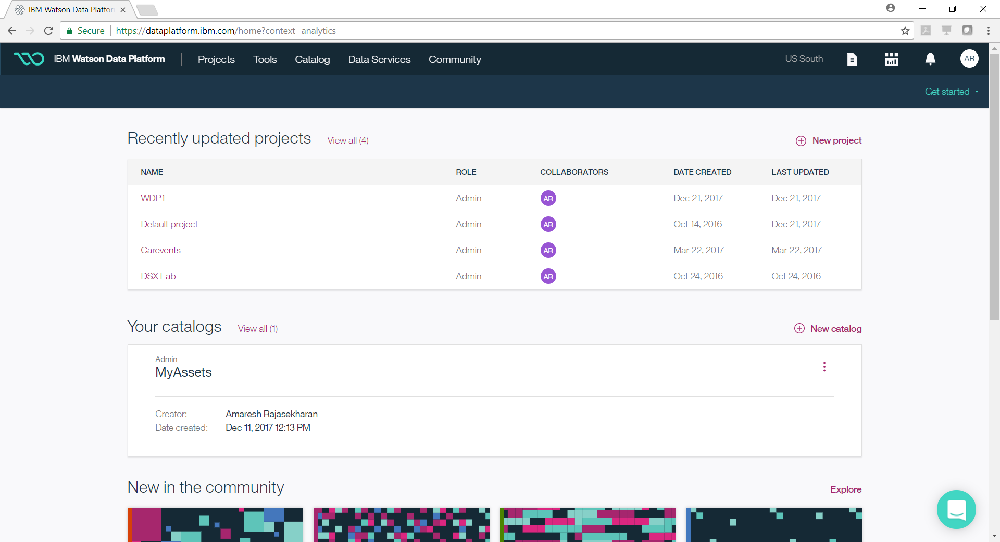

Provide name for the project and select the appropriate cloud object storage and the spark instance from your IBM Cloud workspace. Once you have finished the steps, the resulting screen would look like the following. Click on "Create" button on the lower right bottom of the screen. This will create a new WDP project for us to work further. If you have not created an instance of cloud object storage and spark service, create them first before proceeding with this step.

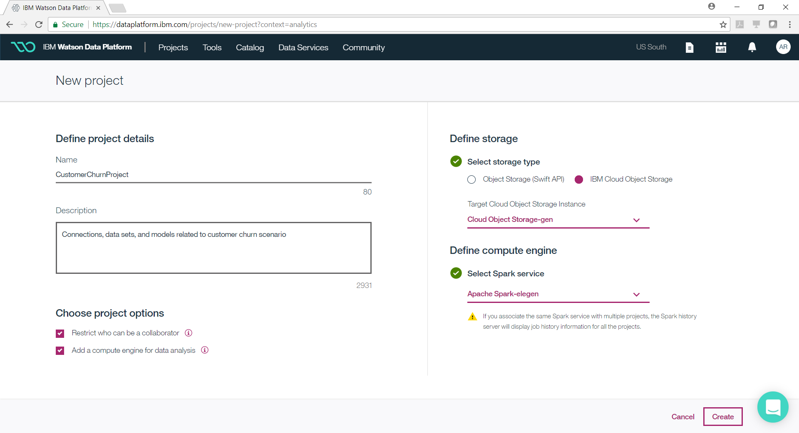

What you just created is a WDP project, in which you will be creating artifacts such as connections to datasources, datasets, notebooks, catalogs, analytical models etc.

After creating the project, you should now be looking at the main screen where you see a list of projects. Click on the newly created project, and you should be seeing a page like the following.

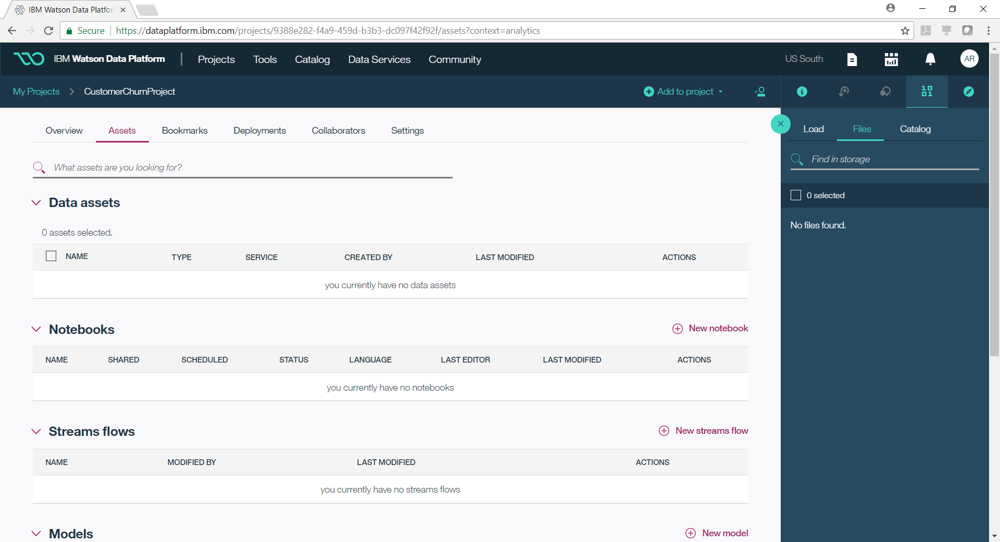

From the tool bar on the right, click on the drop down box "Add to project" and then click on the menu "connection". This is illustrated in the following picture.

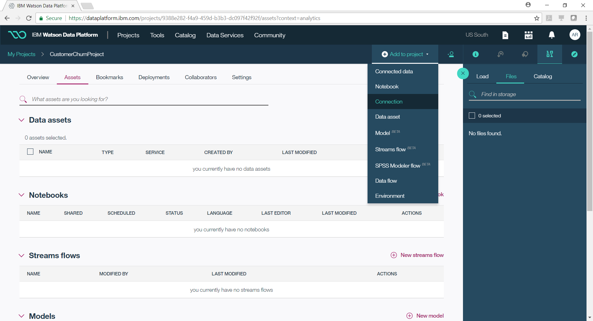

It should take you to a screen where you can see all the datsources supported by WDP. For this example, you will be creating three datasources - cloudant, DB2 Warehouse, and Amazon S3. Each one of these sources contain a particular dataset as described in the section at the introduction section. Note that if you have your data in different systems, choose those systems.

Click on Cloudant database and add it as a connection. The following two screenshots show this step. If you have not created a cloudant instance on IBM Cloud, you should do that first before resuming from this step.

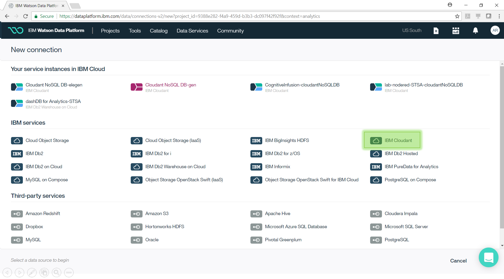

In the screenshot you see all the service instances that are part of IBM Cloud. You can click on "IBM Cloudant" option as highlighted, and proceed to fill in the credentials. Your screen should look like the following after clicking "IBM Cloudant".

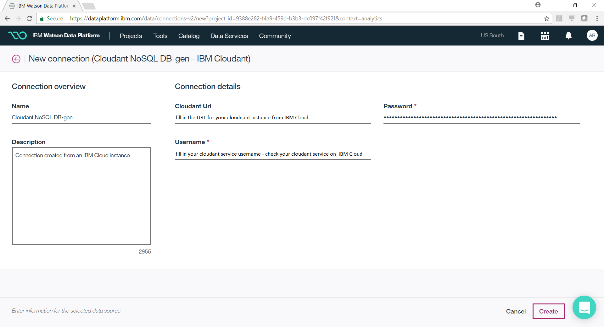

Fill in the credentials and click the button "Create" on the lower right corner of the page. To get the credentials for accessing the cloudant instance, you should open your cloudant instance on IBM Cloud.

Likewise, create two additional connections for DB2Warehouse and Amazon S3. The screen for DB2 Warehouse is shown below.

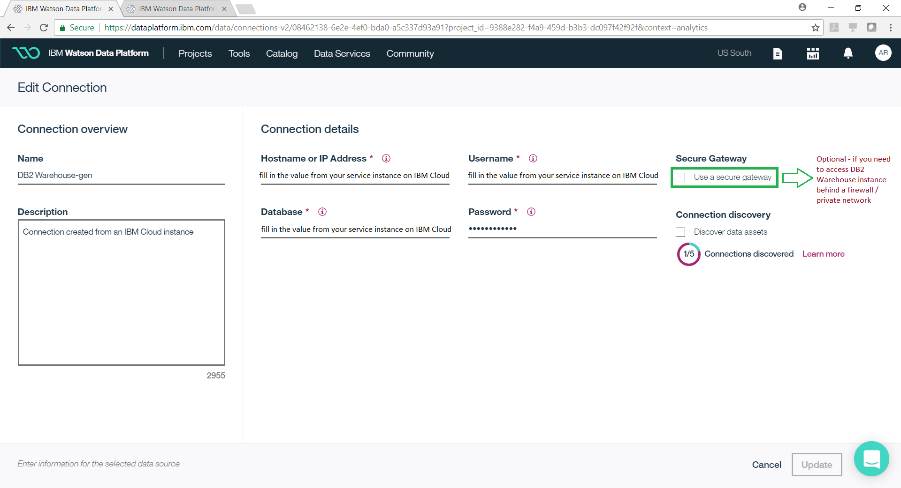

Note that there is a checkbox for secure gateway that you can enable if you are accessing the DB2 Warehouse instance behind a firewall.

Once you have created all the three connections, you should be back to the main screen of your project, where you can see all the three connections listed.

The next step is to import the data from these three datasources, using the connection we just created. Click on the toolbar drop down menu "Add to Project" > "Connected Data" as shown in the following picture.

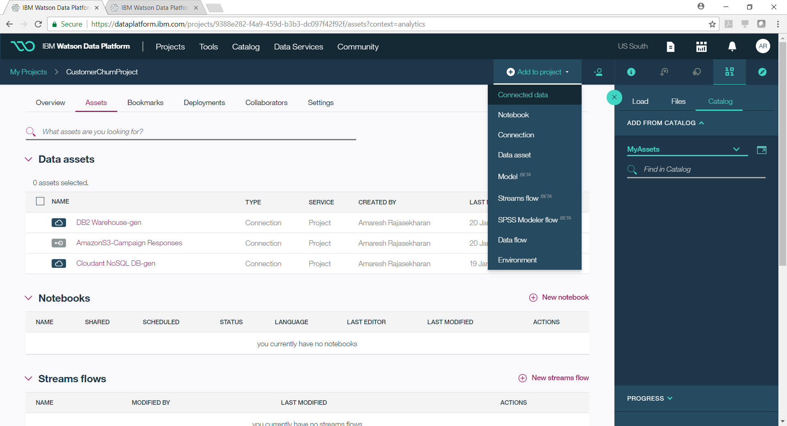

In the resulting screen as shown below, provide a name for the data asset, and click on "Select Source".

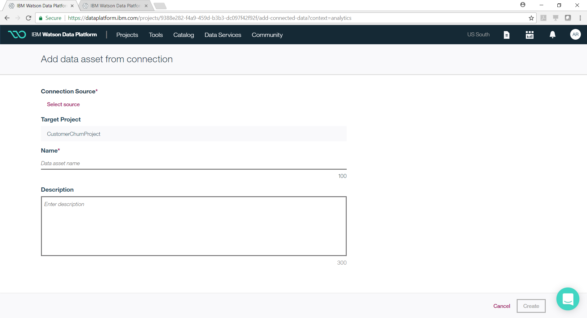

That should bring up a page with all the datasaources created in the previous steps.  The following screenshot illustrates this step.

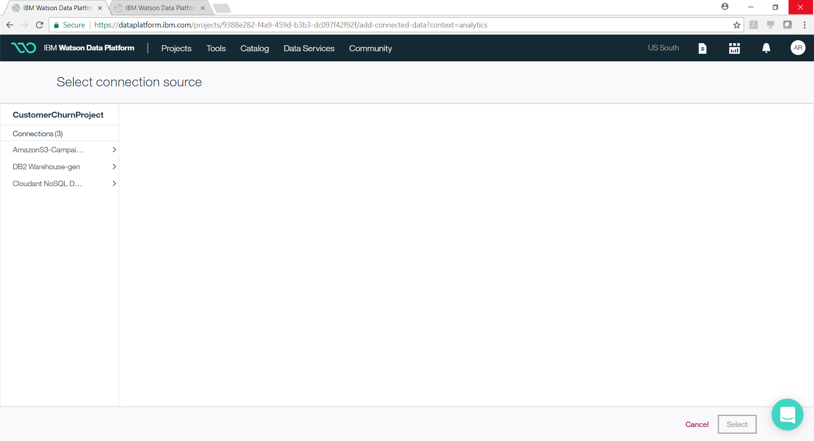

Click on the cloudant based datasource. That would bring up the databases you created on cloudant. Pick the right database, and click on the button "Select" on the lower right corner. The following screenshot shows this part of the operation.

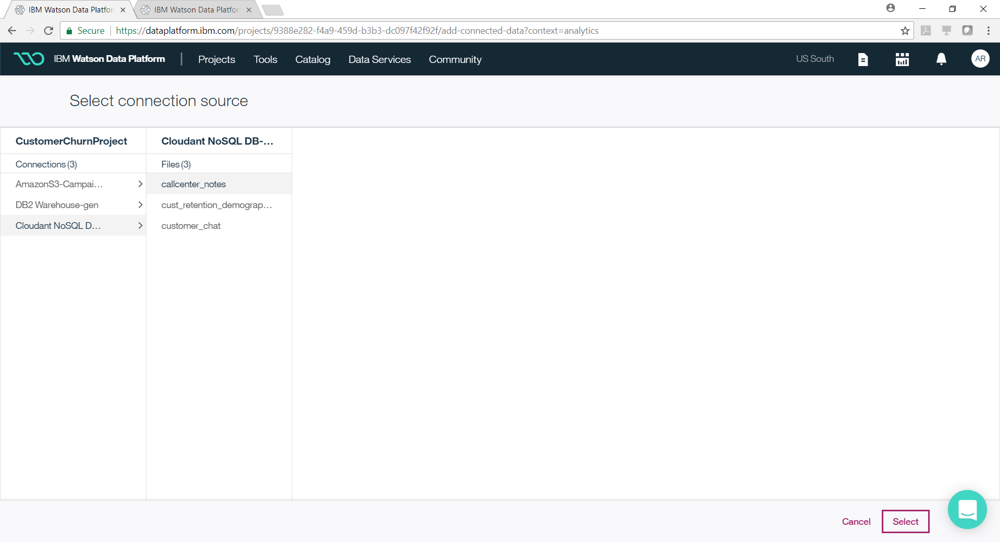

That should bring you back to the original screen from where you selected the datasource. Click on the button "Create" on the lower right corner.

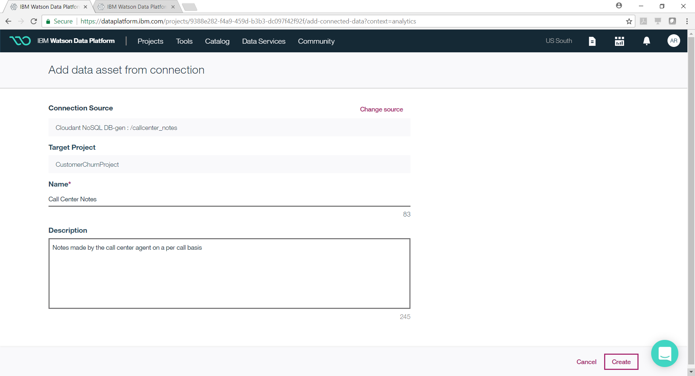

That should complete the steps to import the data asset from cloudant. Likewise repeat the steps for the other two data sources to pull the two data assets we need for analytics.

## Data Preparation / Refinement

In the previous steps we created datasources, and then imported data assets from each one of them. In this section, we will perform some visualizations to explore the data, and perform simple operations to prepare the data. These steps will be performed using the tool Data Refinery, which is part of the Watson Data Platform.

[See note](./CustomerChurnAnalysisCI-bpull.md) of the jupyter notebook exported as markdown file.

## Analytical Model

## Appendix 1: Data Catalogs

## Appendix 2: Performance Monitoring & Fine Tuning
