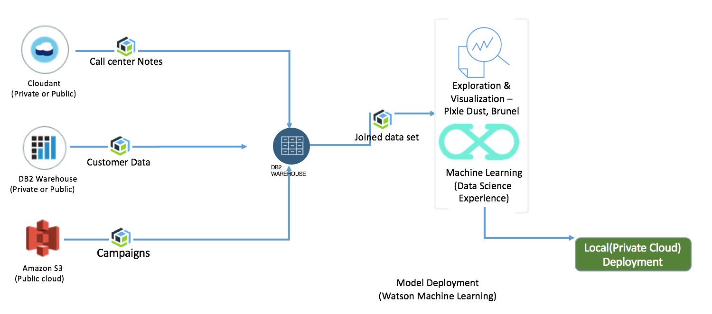

# Building the machine learning model using DSX in ICP

For a pure DSX, Db2 Warehouse and Spark cluster approach, running inside ICP the high level view may look like the figure below:

We use Db2 warehouse to persist the three types of data. The data ingestions can be done with external tools like ETL, or by combining the Remote table definition inside Db2 Warehouse and scripts. We explained the remote table approach in [this note](../data/README.md).

## Data Ingestion
### Customer data
The approach was to use Db2 Warehouse remote table to get access to the data. See [this note for detail](../data/README.md).

### CallNotes
The CallNotes were loaded using the csv file export and load from file capabilities in Db2 Warehouse. ([See this note on how to similarly do csv loading](https://github.com/ibm-cloud-architecture/refarch-analytics/blob/master/docs/db2warehouse/README.md#loading-customer-sample-data)).  
The source for the `CallNotes.csv` file is under data folder. The IDs used in this file match the ID within the DB2 customer table.

### Campaign Responses
The marketing campaign are in the csv file named  `CampainResponses_Expanded.csv` under the data folder. The CSV file is loaded into Db2 warehouse.

## Specific jupyter notebook
The Jupyter notebook is slightly different than the one developed within Watson Data Platform as the data sources are different. You can read the exported as markdown file [here](./CustomerChurnAnalysisDSXICP.md) or load the src/dsx/CustomerChurnAnalysisDSXICP.ipynb file into DSX.

## Deploying to spark
The model can be deployed to a Spark Cluster as a service. We did not finish this step yet. To integrate the call to the deployed model there is a specific Javascript module for the model deployed on ICP.

## Others
For deploying of DSX on ICP see [this detailed section](https://github.com/ibm-cloud-architecture/refarch-analytics/tree/master/docs/ICP)
