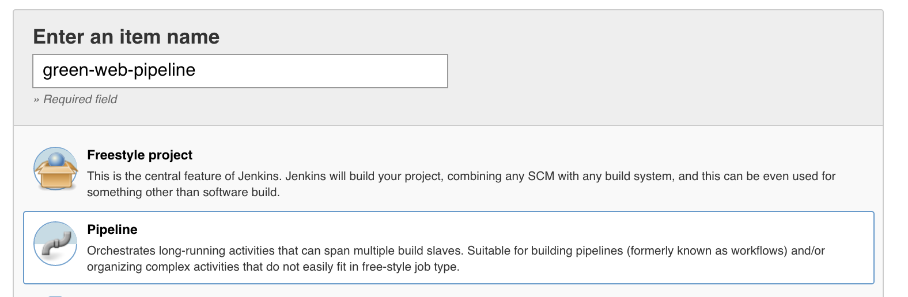
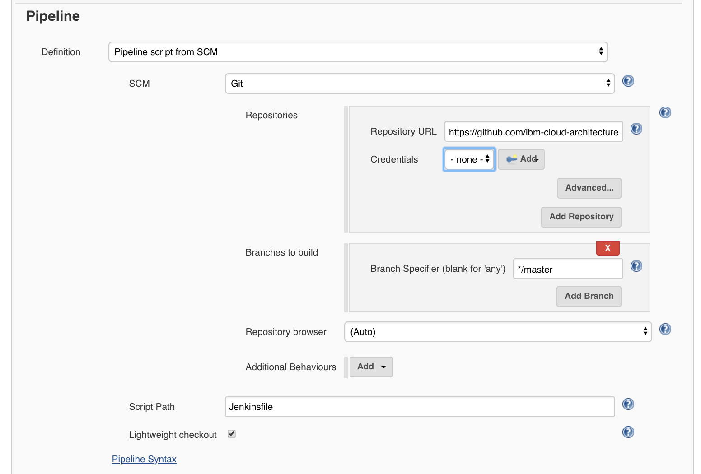

# Run the different components of the solution


### For Watson Conversation service

Create the service in IBM Cloud and get the credentials, update the configuration file (config.json and values.yaml) for the webapp to access the conversation service. [See this note about implementation](./wcs/README.md)

### For Tone analyzer

Create the service in IBM Cloud and get the credentials. See also [this note](./design/w-tone-analyzer.md) for more details.

#
### Jenkins pipeline

We deployed a Jenkins server on IBM Cloud Private following the instructions described [here](https://github.com/ibm-cloud-architecture/refarch-integration/tree/master/docs/devops#jenkins-on-icp), with a PVC named `jenkins-home` under the greencompute namespace and the commands:
```
$ helm install --name greenjenkins --set Persistence.ExistingClaim=jenkins-home --set Master.ImageTag=2.67 stable/jenkins --namespace greencompute
$ cd chart/jenkins
$ kubectl create -f docker-reg-configMap.yaml --namespace greencompute
$ kubectl create -f registry-secret.yaml --namespace greencompute
```
Then we added configMap and secret in kubernetes cluster to keep docker private registry information so that build job can publish docker images to the registry automatically.

The webapp and customer service projects have jenkinsfile that can be used in a Jenkins Pipeline. Pipelines are made up of multiple steps that allow you to build, test and deploy applications.



Then define the URL of the github repository and specify the branch to checkout.


The pipeline is created. You can manually start the build job that runs the pipeline. The job pulls the code from Git repository's master branch and runs the Jenkins file. Then, it builds the Docker image and pushes it to the IBM Cloud Private Docker registry.


## Run

### Run the web application locally

To start the application using node monitoring tool use the command:
```
npm run dev
```
To run in non-development mode
```
npm start
```

The trace should display a message like below with the url to use
```
[1] starting `node server/server server/server`
[1] Server v0.0.1 starting on http://localhost:3001
```

Point your web browser to the url: [http://localhost:3001](http://localhost:3001) to get access to the user interface of the home page.

The demonstration script is described in this [note](./flow/README.md)

### Run web app on IBM Cloud Private

The application can be deployed with `helm install`. Once the docker image is built, you need to remote connect to the master node where the docker private repository resides, and push the image to the repo:
```
$ docker build -t ibmcase/greenapp .
$ docker tag ibmcase/greenapp  greencluster.icp:8500/greencompute/greenapp:v0.0.1
$ docker login greencluster.icp:8500
$ docker push greencluster.icp:8500/greencompute/greenapp:v0.0.1
```

#### Deploy the release using the helm

First you need to rename the file `values-tmpl.yaml` to `values.yaml` and set the parameters as the config.json. We are using the mechanism of config map to externalize the configuration as defined by the `config.json`. While using cloud foundry or pure local nodejs deployment this file is read from the filesystem by the server.js. But with kubernetes pods the best practice is to export this configuration into `ConfigMap`.
To do so we need to create a new template: `templates/configmap.yaml`. This file uses the same structure as the `config.json` file:

```yaml
apiVersion: v1
kind: ConfigMap
metadata:
  name: {{ template "fullname" . }}
  labels:
    chart: "{{ .Chart.Name }}-{{ .Chart.Version | replace "+" "_" }}"
data:
  config.json: |+
    {
    "conversation" :{
        "version" : "{{ .Values.config.conversation.version }}",
        "versionDate":"{{ .Values.config.conversation.versionDate }}",
        "username":"{{ .Values.config.conversation.username }}",
        "password":"{{ .Values.config.conversation.password }}",
        "conversationId":"{{ .Values.config.conversation.conversationId }}",
        "workspace":"{{ .Values.config.conversation.workspace }}",
        "usePersistence": "{{ .Values.config.conversation.usePersistence }}"
      },
    "customerAPI":{
          "url":"{{ .Values.config.customerAPI.url }}",
          "host":"{{ .Values.config.customerAPI.host }}",
          "xibmclientid": "{{ .Values.config.customerAPI.xibmclientid }}"
    },
    "toneAnalyzer":{
          "url": "{{ .Values.config.toneAnalyzer.url }}",
          "versionDate": "{{ .Values.config.toneAnalyzer.versionDate }}",
          "username": "{{ .Values.config.toneAnalyzer.username }}",
          "password": "{{ .Values.config.toneAnalyzer.password }}"
    },
    "scoringService":{
        "type": "{{ .Values.config.scoringService.type }}",
        "baseUrl": "{{ .Values.config.scoringService.baseUrl }}",
        "instance": "{{ .Values.config.scoringService.instance }}",
        "username": "{{ .Values.config.scoringService.username }}",
        "password": "{{ .Values.config.scoringService.password }}"
      },
    "dbCredentials" : {
        "url": "{{ .Values.config.dbCredentials.url }}"
    },
    "debug": "{{ .Values.config.debug }}",
    "port": "{{ .Values.config.port }}",
    "version": "{{ .Values.config.version }}"
    }

```
As you can see the real values are set in the `values.yaml` file. This is an implementation decision to externalize all values in this file, we could have set the value directly in the template as they are not used anywhere else.

### Modify deployment.yaml

To 'inject' the configuration from the `configMap` to the server nodejs app, the trick is to specify that the `config.json` file is coming from a logical volume:

In the deployment.yaml we add a volumeMount point to the container specification:
```yaml
spec:
  containers:
  - name: {{ .Chart.Name }}
    image: "{{ .Values.image.repository }}:{{ .Values.image.tag }}"
    imagePullPolicy: {{ .Values.image.pullPolicy }}
    ports:
    - containerPort: {{ .Values.service.internalPort }}
    volumeMounts:
    - name: config
    mountPath: /greenapp/server/config/config.json
      subPath: config.json
```
the path */greenapp* comes from the dockerfile, working directory declaration:
```docker
COPY . /greenapp
WORKDIR /greenapp
```
so the mountPath will overwrite the `config.json` file.

The volume name (config) is arbitrary but needs to match a volume declared later in the deployment.yaml.

```yaml

   volumes:
      - name: config
        configMap:
          name:  {{ template "fullname" . }}
```
One volume, named `config` uses the configMap named using the template name of the helm package and match the configMap we defined above.

Deploy the chart as a new release
```
$ cd ../chart
$ helm install green-customerapp/ --name green-customerapp --namespace greencompute
```

Assess deployment is successful:
```
$ kubectl logs <pod name> --namespace greencompute
```

Once deployed and started the Web application can be seen at the URL: http://greenapp.green.case

### Run the Jupyter notebook

The main root project for green compute includes a dockerfile to get all the interesting components you may want to run to execute and develop Jupyter notebooks on your own. If you use `docker build -t pysparktf .`, you should get the image with python, sklearn, all spark python modules and even Tensorflow.

```
REPOSITORY                           TAG         IMAGE ID            CREATED             SIZE
pysparktf                            latest      ee5d45e40097        2 months ago        5.29G
pyspark                              latest      06821066e790        3 months ago        5.01GB
jupyter/pyspark-notebook             latest      f4f7de14d4a7        3 months ago        4.56GB

```

From those docker images you can run a container that mounts your local folder where you have notebook under the work folder. The script `./startLocalJupyter.sh`, and then run the kernel.
