# Support Chat bot with Watson Assistant
We recommend to follow [this tutorial](https://www.ibm.com/cloud/garage/tutorials/watson_conversation_support) to learn how to develop a Watson Assistant service and dialog flow.  
The implemented Watson Assistant workspace is under the folder `src/wcs`, named `telco-support-wcs-wks.json` and you can import it into your own Watson Assistant service:

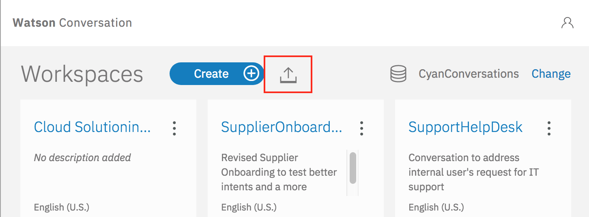

Once loaded the workspace is named "Telco Support".

## What we built:
For this project, looking at the [use case](https://github.com/ibm-cloud-architecture/refarch-cognitive-analytics#use-case) description, and the type of interactions expected by end users, like Eddie, we implemented the following intents:
* *Request status* to address when a user is asking from an existing rebate request, or support request.
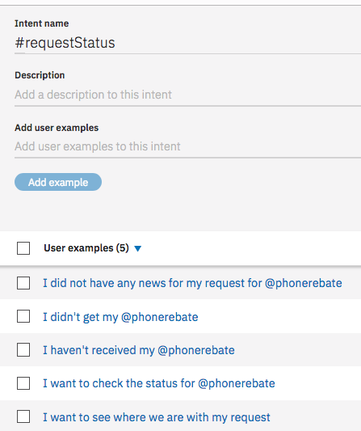

* *network data quality* to support query about data issue while roaming.
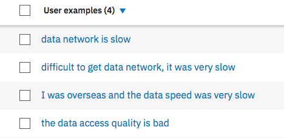

Then we worked on the dialog flow to define how to respond to those intents. We need to have one node per intent:
* Add one to support the *rate plan request* intent, one to assess the status of an existing ticket, and  one for data quality...

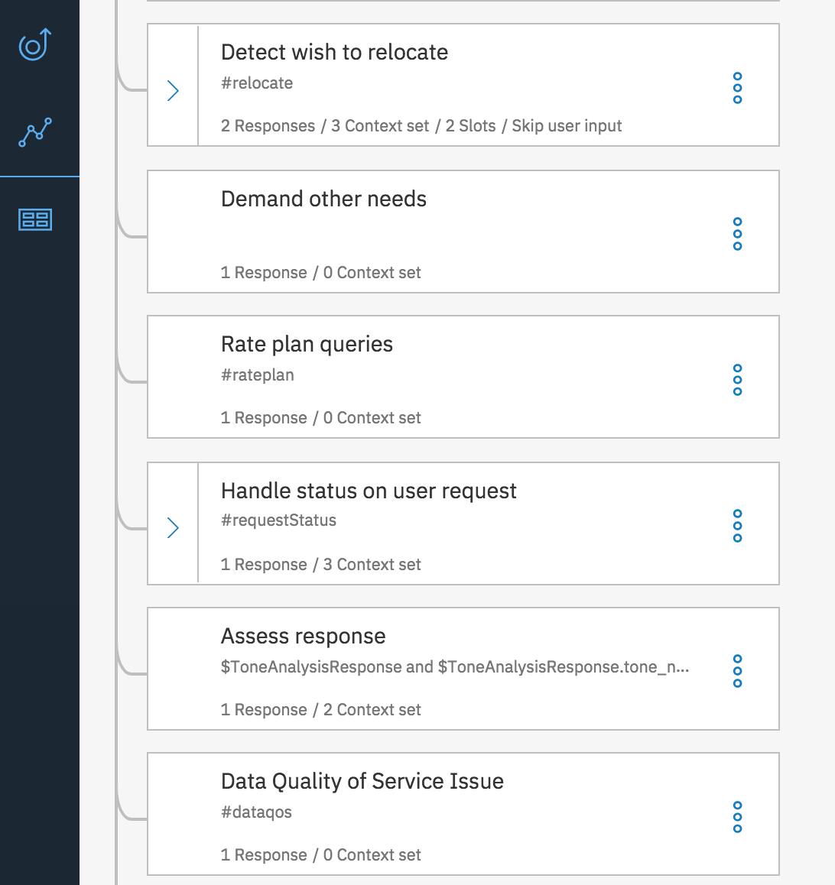

* In the **Handle the ticket status request** we use the conversation context to drive control of the chatbot flow: setting the context variables action and item to `search` and `UserRequest`. Also as conversation about a ticket status may be emotional, we trigger the call to ToneAnalyzer by setting a new context variable to true:

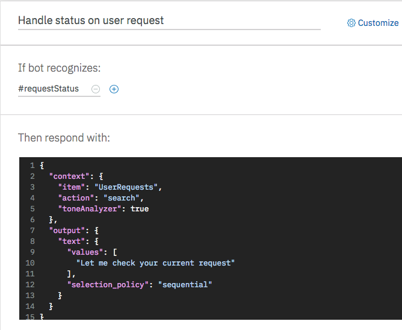

* When the system returns the ticket information, the code could have returned the answer directly, but it is good practice to come back to the dialog flow to manage response, usingthe context variables to control the response as illustrated in figure below:

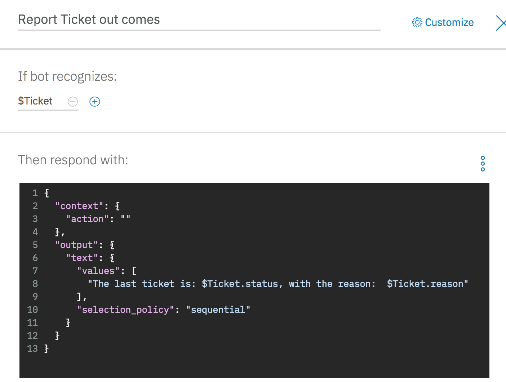

* Finally when the tone analyzer returns a potential negative tone, the code calls the churn scoring service, adds the to the conversation context, and now the dialog can prepare an adequate response:

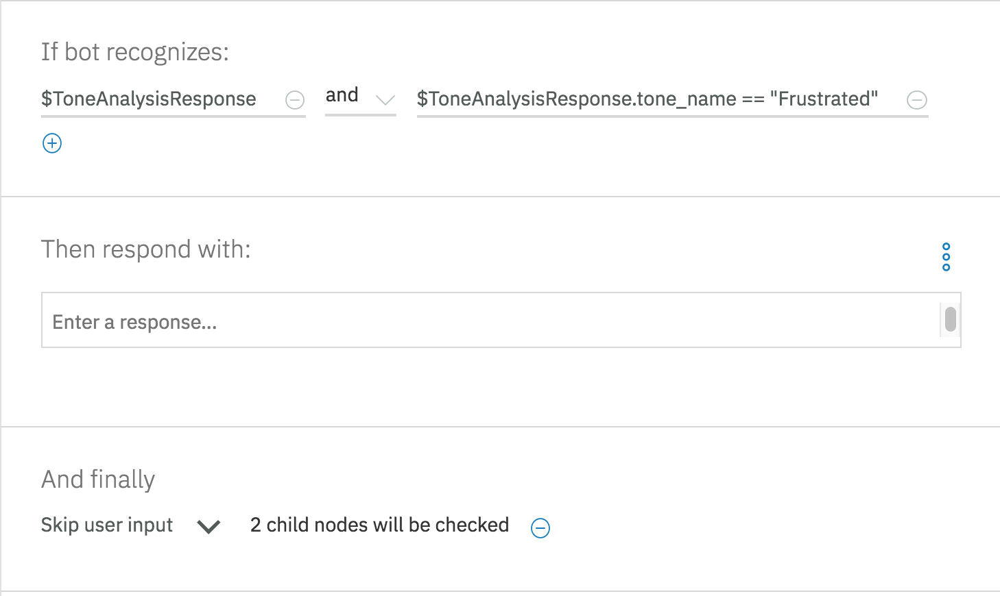

using the churn risk scoring:

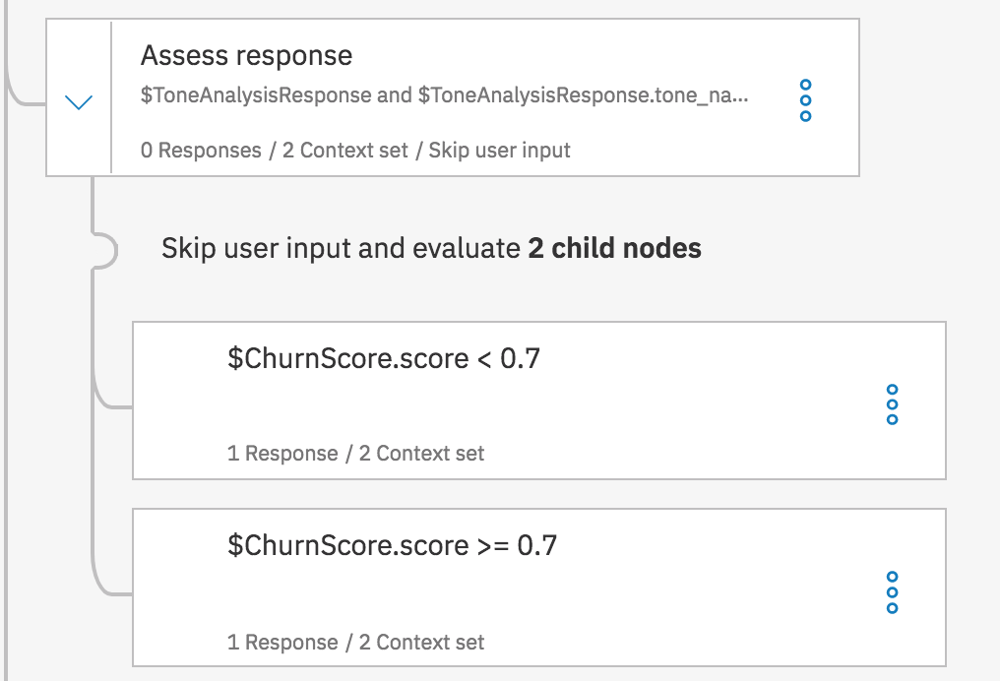  

If the scoring risk is below `.7` the processing will use automatic email processing, the reported message will look like:

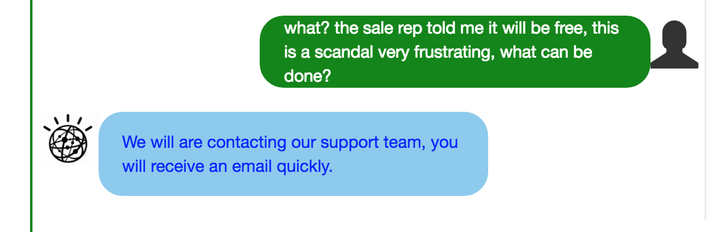

as the node condition:

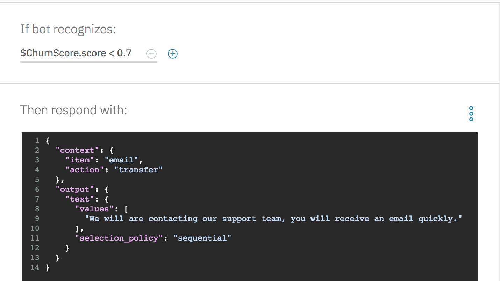

When the score is higher than `.7`, we want to like transfer to a human.

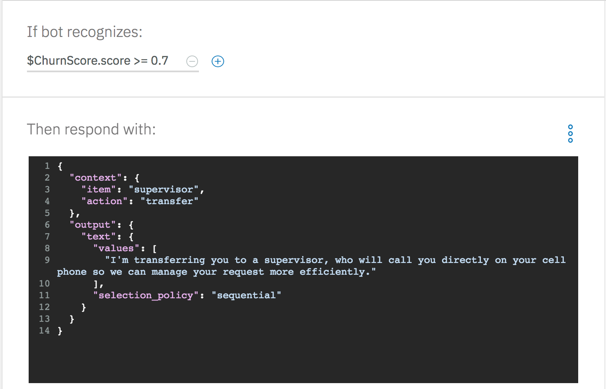

Recall that you can unit test the conversation inside the Editor. See the tutorial on how to do so.
Assistant
